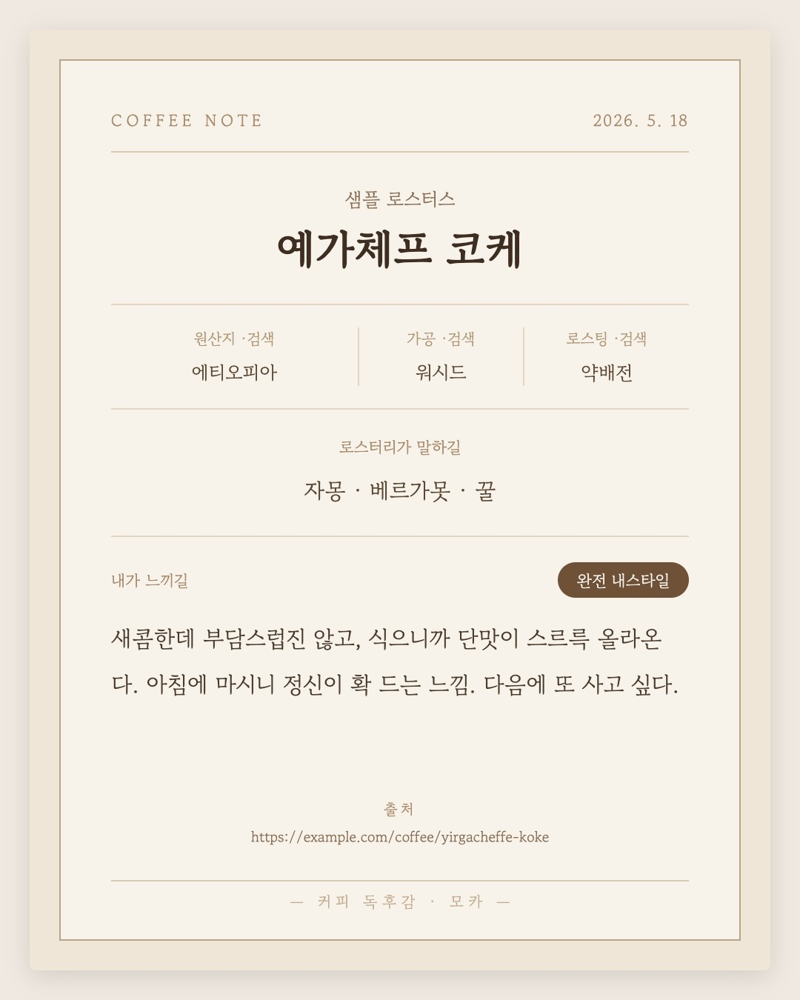

# 🐕☕ 모카 (Mocha)

> "예가체프 마셨는데 새콤하고 좋았어" — 이 한 마디면 충분합니다.
> 나머지는 모카가 알아서 적어두는, 나만의 커피 기록 비서.

**✅ 1차 개발을 마쳤어요.** 메신저로 커피 한마디 → 조사 → 확인 → 카드 이미지로 배달까지, 핵심 흐름이 처음부터 끝까지 동작합니다. 이제부터는 매일 마시는 커피로 직접 써보며 다듬어 가는 단계입니다.

## 이런 고민에서 시작했어요

드립 커피를 몇 년을 마셨는데, 어느 날 문득 깨달았습니다. *내가 무슨 커피를 좋아하는지 나도 모른다.* 에티오피아였나? 워시드가 좋았나? 기억이 안 나는 건 당연했어요. 한 번도 적어둔 적이 없으니까.

그렇다고 전문가들처럼 커핑 노트를 쓰자니 부담스럽고, 앱 열어서 원산지·가공방식·로스팅 정도를 하나하나 입력하는 건... 솔직히 세 번 하고 그만둘 게 뻔했습니다.

그래서 생각했어요. **기록에 드는 수고를 "말 한마디"까지 줄이면, 그제야 기록이 쌓이지 않을까?**

## 모카는 이렇게 일해요

1. **말 걸기** — 평소 쓰는 메신저(Slack)에서 모카에게 오늘 마신 커피 얘기를 합니다. 사진을 같이 보내도 돼요. "커피베라 예가체프 마셨는데 새콤하고 좋았다" 정도면 충분합니다.
2. **모카가 조사하기** — 커피 이름을 단서로 원산지, 가공방식, 로스터리가 소개하는 공식 향미 노트("자몽, 베르가못, 꿀" 같은 것)를 찾아서 채워 넣습니다.
3. **확인받기** — 저장하기 전에 "이렇게 적어둘까요?" 하고 정리본을 보여줍니다. 인터넷에서 찾아온 정보에는 `(검색)` 표시가 붙어 있어서, 틀린 부분만 쓱 보고 고쳐주면 됩니다. 말로 고쳐도 돼요 — "산미는 낮음으로 바꿔줘."
4. **카드로 받기** — 저장하면 그 한 잔이 세로형(4:5) 카드 이미지로 그려져 Slack으로 바로 옵니다. 폰에 저장하거나 SNS에 그대로 올릴 수 있어요. 지금까지 남긴 시음들은 최신순 목록으로도 자동 정리됩니다.

<p align="center">
  
  <br>
  <sub><i>실제로 배달되는 카드 예시 (샘플 데이터로 생성)</i></sub>
</p>

## 이 프로젝트에서 제일 좋아하는 부분

**로스터리의 말과 나의 말을 나란히 둡니다.**

> 🏷 로스터리가 말하길 — 자몽, 베르가못, 꿀
> 💬 내가 느끼길 — 새콤한데 부담스럽진 않고, 식으니까 단맛이 올라옴

저는 "자몽 느낌"이 뭔지 잘 모르겠거든요. 그래도 괜찮습니다. 둘을 따로 적어두면 언젠가 이런 질문에 답할 수 있게 되니까요 — *"봉투에 '자몽'이라 적힌 원두를, 나는 정말 좋아하는 걸까?"*

그리고 **같은 커피를 다시 마시면 새 노트가 아니라 그 커피의 노트에 날짜별로 기록이 쌓입니다.** 같은 원두도 내리는 날마다 다르게 느껴지는데, 그 변화를 보는 것도 재미라서요.

## 안심 포인트

- **기록은 전부 내 컴퓨터에만 저장됩니다.** 어딘가의 서버에 올라가지 않아요.
- **모카 마음대로 저장하지 않습니다.** 항상 확인을 거친 뒤에만 기록해요.
- 노트를 꾸미는 디자인이 바뀌어도 **원본 기록은 그대로 보존**되는 구조입니다.

## 지금까지의 여정

- [x] 설계 문서 완성 — 무엇을, 왜, 어떻게 만들지 정리
- [x] 모카 제작(1차) — 메신저 연결부터 카드 이미지 배달까지 핵심 흐름 완성
- [ ] 실제로 쓰면서 다듬기 — 매일 마시는 커피로 직접 써보고, 불편한 점을 고쳐나가는 과정도 기록

만드는 도중에도 실사용에서 관측된 불편을 바로바로 반영하며 여러 번 방향을 손봤어요. (처음엔 A4로 인쇄하는 노트였다가 "폰에서 바로 저장·공유"가 진짜 필요란 걸 깨닫고 4:5 카드 배달로 바꾼 게 그런 예입니다.) 언젠가는 다른 사람들도 쉽게 설치해서 쓸 수 있는 버전을 만들어보고 싶지만, 일단은 제 커피 기록부터 착실히 쌓는 게 목표입니다.

---

<details>
<summary>🔧 개발자를 위한 정보</summary>

**스택**: Java 21 · Spring Boot 4 · Slack SDK(Socket Mode) · OpenAI API(구조화 추출 + 웹 검색, 인터페이스로 추상화) · Thymeleaf(카드 HTML 조립) + Playwright/Chromium(헤드리스로 4:5 카드 JPG 래스터화) · DB 없이 로컬 JSON 파일이 source of truth.

**구동**: 집 로컬 머신의 단일 프로세스. Socket Mode라 공인 IP·SSL·인바운드 개방이 필요 없고, 저장 시 그 시음의 엔트리 카드(JPG)를 구워 Slack으로 배달합니다. 지난 시음은 `file://`로 여는 `index.html` 최신순 목록에서 훑어봅니다.

**진행 방식**: SDD(Spec-Driven Development). 모든 요구사항(FR)·수용 기준(AC)·설계 결정(ADR)이 [`specs/coffee-note-agent/`](specs/coffee-note-agent/)에 문서화되어 있고, 구현·테스트가 이를 참조합니다. 읽는 순서: [spec](specs/coffee-note-agent/spec.md) → [plan](specs/coffee-note-agent/plan.md) → [data-model](specs/coffee-note-agent/data-model.md) → [tasks](specs/coffee-note-agent/tasks.md)

```
specs/coffee-note-agent/   # SDD 명세 (source of truth)
CLAUDE.md                  # 프로젝트 공통 지침
data/                      # (런타임) 노트 JSON·사진 — 커밋 안 함
artifact/                  # (런타임) 엔트리 카드 JPG·index HTML·썸네일 — JSON에서 재생성 가능한 파생물
```

</details>

<details>
<summary>🔌 부록: Slack 앱 셋업 (Socket Mode)</summary>

모카는 인바운드 개방 없이(공인 IP·SSL·포트포워딩 불요) Slack **Socket Mode**로 메시지·사진을 받습니다(ADR-2, NFR-1). 로컬에서 처음 구동하려면 개인 Slack 워크스페이스와 앱을 한 번 준비해야 합니다. 아래 절차로 봇 토큰(`xoxb-`)과 앱 토큰(`xapp-`) 2종을 발급받아 `.env`에 넣으면 됩니다. *(미래 셀프호스팅 배포 시 이 부록이 설치 가이드의 씨앗이 됩니다.)*

1. **개인 워크스페이스 신설** — [slack.com/get-started](https://slack.com/get-started)에서 개인용 워크스페이스를 새로 만듭니다. 단일 사용자·개인 데이터 격리가 목적이므로 기존 팀 워크스페이스와 섞지 않습니다(OQ-4, NFR-6).
2. **앱 생성** — [api.slack.com/apps](https://api.slack.com/apps) → **Create New App → From scratch**. 이름은 `Mocha`(또는 모카), 워크스페이스는 1번에서 만든 것을 선택합니다.
3. **Socket Mode 활성화 → App-Level Token 발급** — 좌측 **Settings → Socket Mode**를 Enable. 이때 앱 레벨 토큰을 생성하라는 창이 뜨면 scope `connections:write`로 만듭니다. 여기서 나오는 **`xapp-...`** 이 `SLACK_APP_TOKEN`입니다.
4. **이벤트 구독** — **Features → Event Subscriptions**를 Enable. Socket Mode라 Request URL은 필요 없습니다. **Subscribe to bot events**에 다음을 추가합니다:
   - `message.im` — 봇과의 DM 텍스트 수신(FR-1)
   - `file_shared` — 사진(파일) 수신(FR-1, FR-10)
5. **Bot Token Scopes** — **Features → OAuth & Permissions → Scopes → Bot Token Scopes**에 최소 다음을 추가합니다:
   - `chat:write` — 확인 미리보기 메시지 전송/수정(FR-4)
   - `im:history` — DM 메시지 읽기
   - `files:read` — 첨부 사진 다운로드(FR-10)
   - `files:write` — 저장 완료 시 엔트리 카드 JPG를 채널에 업로드(FR-16, `files.uploadV2`)
6. **Block Kit 인터랙션 활성화** — **Features → Interactivity & Shortcuts**를 Enable. Socket Mode라 URL은 비워 둡니다. [저장]/[취소] 버튼 액션 수신에 필요합니다(FR-4).
7. **워크스페이스에 설치 → Bot Token 발급** — **OAuth & Permissions → Install to Workspace**. 설치 후 나오는 **`xoxb-...`** 이 `SLACK_BOT_TOKEN`입니다. (스코프를 바꾸면 재설치가 필요합니다.)
8. **봇 초대** — Slack에서 모카 봇에게 DM을 열어 대화를 시작합니다. (채널에서 쓸 거라면 해당 채널에 `/invite @Mocha`.)
9. **토큰 주입** — `.env.example`을 복사해 `.env`(또는 `.env.local`)를 만들고 `SLACK_BOT_TOKEN`·`SLACK_APP_TOKEN`·`OPENAI_API_KEY`를 채웁니다. **`.env`류는 절대 커밋하지 않습니다**(`.gitignore`로 차단, CLAUDE.md §5).

</details>

---

*모카는 갈색 포메라니안입니다. 이름은 라이트 로스팅 원두색 털에서 왔어요.* 🐾