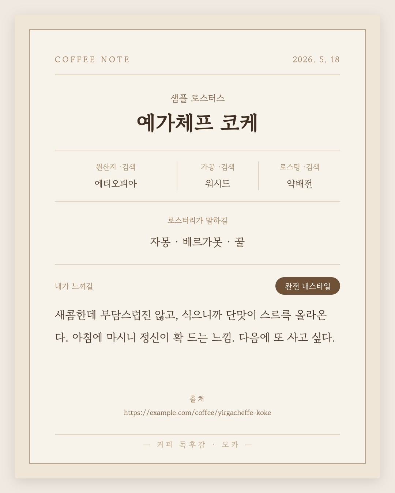

# 🐕☕ 모카 (Mocha)

> "예가체프 마셨는데 새콤하고 좋았어" — 이 한 마디면 충분합니다.
> 나머지는 모카가 알아서 적어두는, 나만의 커피 기록 비서.

**✅ 매일 마시는 커피로 직접 써보며 다듬는 중입니다.** 커피 한마디 → 조사 → 확인 → 저장 → 다시 보기 → 카드 이미지로 공유까지, 핵심 흐름이 처음부터 끝까지 동작해요. 쓰면서 관측된 불편은 그때그때 반영하고 있습니다. 최근에는 두 번의 큰 개편이 있었어요 — 기록을 파일이 아니라 **데이터베이스**에 두게 됐고, 입구가 메신저(Slack)에서 **내 폰·노트북 브라우저에서 여는 앱**으로 바뀌었습니다.

## 이런 고민에서 시작했어요

드립 커피를 몇 년을 마셨는데, 어느 날 문득 깨달았습니다. *내가 무슨 커피를 좋아하는지 나도 모른다.* 에티오피아였나? 워시드가 좋았나? 기억이 안 나는 건 당연했어요. 한 번도 적어둔 적이 없으니까.

그렇다고 전문가들처럼 커핑 노트를 쓰자니 부담스럽고, 앱 열어서 원산지·가공방식·로스팅 정도를 하나하나 입력하는 건... 솔직히 세 번 하고 그만둘 게 뻔했습니다.

그래서 생각했어요. **기록에 드는 수고를 "말 한마디"까지 줄이면, 그제야 기록이 쌓이지 않을까?**

## 모카는 이렇게 일해요

1. **말 걸기** — 앱의 채팅 화면에서 오늘 마신 커피 얘기를 합니다. ＋로 원두 봉투 사진을 같이 붙여 보내면 봉투에 적힌 정보까지 읽어둬요. "커피베라 예가체프 마셨는데 새콤하고 좋았다" 정도면 충분합니다.
2. **모카가 조사하기** — 같이 온 사진(원두 봉투)에서 먼저 읽고, 모자란 건 커피 이름을 단서로 원산지, 가공방식, 로스터리가 소개하는 공식 향미 노트("자몽, 베르가못, 꿀" 같은 것)를 찾아서 채워 넣습니다. 찾은 정보가 정말 그 원두의 것인지 따져보고, 확신이 없으면 지어내는 대신 비워둡니다.
3. **확인하고 고치기** — 저장하기 전에 채팅 안에 **작성 폼**이 열립니다. 사진에서 읽은 값에는 `(사진)`, 인터넷에서 찾아온 값에는 `(검색)` 표시가 붙어 있어서, 틀린 칸만 그 자리에서 고쳐 쓰면 돼요. 확인 없이는 아무것도 저장되지 않습니다.
4. **저장하고 다시 보기** — [저장]을 누르면 그 한 잔이 **갤러리**에 쌓입니다. 원두 봉투 사진이 카드처럼 깔리고, 검색창과 필터(로스터리·가공방식·원산지·평가)로 골라볼 수 있어요. 한 장을 열면 그 커피의 날짜별 기록이 전부 보입니다.
5. **카드로 공유하기** — 상세 화면의 [공유] 버튼을 누르면 그 회차가 세로형(4:5) 카드 이미지로 그려집니다. 폰에서는 공유 시트로, PC에서는 파일로 받아 SNS에 그대로 올릴 수 있어요.

기록한 다음에도 말로 다 됩니다. *"어제 마신 첼베사 평가 낮춰줘"* 하면 모카가 그 기록을 찾아 **수정용 폼**을 요구가 반영된 채로 띄워줘요 — 확인하고 [저장]만 누르면 됩니다. 대화의 흐름도 기억해요 — *"엊그제 마신 거 있잖아"* 하면 날짜를 헤아려 찾고, 후보가 여럿이면 되물은 뒤 이어지는 대답을 알아듣습니다. 물론 화면에서 직접 고쳐도 되고요(상세 → 수정, 삭제도 여기서). 커피 잡담을 걸면 잡담으로 받아줍니다.

보낸 사진은 그 시음의 날짜별 폴더에 원본 그대로 보관되고, 갤러리 썸네일과 상세 화면에서 다시 볼 수 있어요. 저장할 때 **사진에 붙어 있던 위치 정보(EXIF)는 지웁니다.**

<p align="center">
  
  <br>
  <sub><i>공유할 때 구워지는 카드 예시 (샘플 데이터로 생성)</i></sub>
</p>

## 이 프로젝트에서 제일 좋아하는 부분

**로스터리의 말과 나의 말을 나란히 둡니다.**

> 🏷 로스터리가 말하길 — 자몽, 베르가못, 꿀
> 💬 내가 느끼길 — 새콤한데 부담스럽진 않고, 식으니까 단맛이 올라옴

저는 "자몽 느낌"이 뭔지 잘 모르겠거든요. 그래도 괜찮습니다. 둘을 따로 적어두면 언젠가 이런 질문에 답할 수 있게 되니까요 — *"봉투에 '자몽'이라 적힌 원두를, 나는 정말 좋아하는 걸까?"*

그리고 **같은 커피를 다시 마시면 새 노트가 아니라 그 커피의 노트에 날짜별로 기록이 쌓입니다.** 같은 날 두 번 내렸다면 그날 기록 안에 1회차·2회차로 나뉘고요. 같은 원두도 내리는 날마다, 내릴 때마다 다르게 느껴지는데 그 변화를 보는 것도 재미라서요.

## 안심 포인트

- **기록은 전부 내 컴퓨터에만 저장됩니다.** 어딘가의 서버에 올라가지 않아요. (커피 이름을 조사할 때 감상 문장이 AI API로 나가는 것은 예외이고, 이건 기능의 전제라 없앨 수 없습니다.)
- **모카 마음대로 저장하지 않습니다.** 대화 중에는 어떤 기록도 쓰이지 않고, 오직 [저장]을 눌렀을 때만 저장돼요.
- **사진의 위치 정보는 지우고 보관합니다.** 언제 어디 있었는지의 흔적이 남지 않아요.
- 카드 디자인이 바뀌어도 **원본 기록은 그대로 보존**되는 구조입니다. 카드는 언제든 다시 구울 수 있는 파생물이에요.

## 지금까지의 여정

- [x] 설계 문서 완성 — 무엇을, 왜, 어떻게 만들지 정리
- [x] 모카 제작(1차) — 메신저 연결부터 카드 이미지 배달까지 핵심 흐름 완성
- [x] 모카 개편(2차) — 내부 구조를 "도구를 스스로 골라 쓰는 에이전트" 방식으로 전면 교체
- [x] 모카 개편(3차) — 기록을 **데이터베이스**로 옮기고, 입구를 메신저에서 **앱**으로 교체
- [ ] 실제로 쓰면서 다듬기 — 매일 마시는 커피로 직접 써보고, 불편한 점을 고쳐나가는 과정도 기록 (진행 중)
- [ ] 집 밖에서도 쓰기 — 지금은 집에서만 씁니다. 필요해지면 그때 여는 스위치로 남겨뒀어요

만드는 도중에도 실사용에서 관측된 불편을 바로바로 반영하며 여러 번 방향을 손봤어요. 처음엔 A4로 인쇄하는 노트였다가 "폰에서 바로 저장·공유"가 진짜 필요란 걸 깨닫고 4:5 카드로 바꿨고, 카드에 넣던 사진은 막상 SNS에 올릴 땐 폰 원본을 쓴다는 걸 확인하고 "정보 읽기 + 보관" 역할로 정리했습니다(그 사진은 갤러리가 생기며 다시 화면으로 돌아왔어요).

가장 큰 손질은 두 번의 개편이었습니다. **2차**는 잔버그의 뿌리를 뽑는 일이었어요 — 검색·수정 기능을 붙일수록 버그가 기능 사이의 이음새에서 났는데("아까 그거"를 못 알아듣거나, 수정하려던 내용이 사라지거나), 원인이 같더라고요. 모카가 대화 맥락을 잇지 못하고 매번 처음부터 판단하는 구조 자체가 문제였습니다. 그래서 정해진 절차 대신 **필요한 도구를 스스로 골라 쓰는 에이전트**로 머리를 갈아끼웠습니다.

**3차**는 더 근본적이었어요. 저장된 기록을 말로 고치는 기능을 다섯 번 썼는데 다섯 번 다 조용히 틀린 데이터가 쓰였습니다. 원인을 파보니 AI가 헷갈린 게 아니라, *"메신저에는 초안을 직접 만질 방법이 없어서"* 만들어 둔 우회로가 낳은 버그였어요 — 로스터리를 고치려면 로스터리가 이미 같아야 하는, 논리적으로 불가능한 구조. 그래서 버그를 고치는 대신 **그 버그가 존재할 수 있는 구조를 없앴습니다**: 입구를 앱으로 옮기고, 확인 화면을 "읽기만 하는 미리보기"에서 **직접 고치는 폼**으로 바꿨어요. 고치는 일이 값싸지니 갤러리·상세·삭제처럼 미뤄뒀던 것들도 자연스럽게 따라왔습니다. 그러면서도 "저장은 반드시 내 확인을 거친다"는 원칙은 처음부터 지금까지 그대로입니다.

*(재밌는 뒷이야기: 앱으로 옮기고 나서 "요즘 원두 정보를 안 찾아주는데?"를 발견했어요. 파보니 2차 개편 때 «항상 도는 단계»였던 웹 검색을 «모델이 부를지 정하는 도구»로 바꿨고, 모델은 조용히 안 부르기로 했더군요. 검색은 다시 "빈 칸이 있으면 반드시 도는 단계"로 되돌렸습니다.)*

언젠가는 다른 사람들도 쉽게 설치해서 쓸 수 있는 버전을 만들어보고 싶지만, 일단은 제 커피 기록부터 착실히 쌓는 게 목표입니다.

---

<details>
<summary>🔧 개발자를 위한 정보</summary>

**스택**: Java 21 · Spring Boot 4.1 · **PostgreSQL 17 + Spring Data JPA + Flyway + QueryDSL**(DB = source of truth) · **React + TypeScript + Vite**(Gradle 빌드에 통합 — `./gradlew build` 하나로 프론트가 함께 빌드돼 같은 jar로 나가고, Spring이 정적 서빙) · REST API(`/api/**`) · OpenAI Responses API 기반 **tool-calling 에이전트 루프**(function tool 3종 — `list_notes`·`get_note`·`propose_record`) + 결정론 단계 2종(사진 vision OCR 전처리 · 조건부 검색 보강) · Thymeleaf(카드 HTML 조립) + Playwright/Chromium(헤드리스로 4:5 카드 JPG 래스터화).

**아키텍처**

- **한 프로세스가 API와 화면을 함께 낸다.** `/api/**`는 REST 컨트롤러가 받고(매핑이 없으면 fallback 없이 404), 나머지 경로는 `index.html`로 떨어져 클라이언트 라우터가 해석한다. 프로세스 1개·오리진 1개라 CORS가 애초에 없다.
- **에이전트 턴은 어떤 행도 쓰지 않는다.** `POST /api/agent/turn`(`{utterance, draft?, photos?}`)이 사진 OCR → 루프 → 제안 수거 → 조건부 검색 보강을 거쳐 `{reply, draft}`를 돌려주고, **작성 중인 폼은 클라이언트가 소유**한다(서버에 확인 대기 상태가 없다). 실제 쓰기는 `POST /api/notes`(신규·회차 추가)와 `PATCH /api/notes/{id}`·`/tasting-days/{date}`(수정)뿐이다.
- **계층 분할 축은 트랜잭션이다**: `Controller → NoteService`(외부 IO 오케스트레이션) `→ NoteTxService`(한 트랜잭션 단위 비즈니스 로직) `→ NoteEntityRepository`(행 입출력). 도메인↔엔티티 변환·조립은 층이 아니라 순수 함수(`NoteEntityMapper`)다.
- **카드는 요청받은 때 굽는다.** `artifact/cards/`는 산출 디렉터리가 아니라 **캐시**이고, 쓰기 경로는 굽는 대신 **쓰기 전에 무효화**한다. 어느 카드든 DB만으로 다시 만들어진다(`--rerender`가 전체 예열 + 고아 정리).
- **사진은 파일이 정본, DB 행은 색인이다**(`note_photo`). 업로드가 EXIF를 지워 스테이징에 세우고, 저장 커밋 뒤에 아카이브로 옮기며 색인을 남긴다 — 어느 실패 조합에서도 사진 바이트가 조용히 사라지지 않는 순서다.

전체 클래스 역할과 기능별 흐름, HTTP 표면 요약은 [`docs/architecture-classes-and-flows.md`](docs/architecture-classes-and-flows.md) 참조.

**구동**: 집 로컬 머신의 단일 프로세스(포트 하나). 공인 IP·SSL·포트포워딩은 없고, 집 밖 접근(Tailscale)은 필요가 생기면 켜는 스위치로 백로그에 남겨뒀다.

**테스트**: `./gradlew test`(645건, 실 Chromium·실 OpenAI 호출 제외) · 저장소 통합 테스트는 인메모리 대체 없이 **로컬 Postgres의 `test` 스키마**를 쓴다 · `./gradlew evalTest`는 실 LLM으로 도는 **행동 회귀 하네스**(실발화 케이스 리플레이 + 계약 판정, 비용 발생하므로 온디맨드).

**진행 방식**: SDD(Spec-Driven Development). 모든 요구사항(FR)·수용 기준(AC)·설계 결정(ADR)이 [`specs/coffee-note-agent/`](specs/coffee-note-agent/)에 문서화되어 있고, 구현·테스트가 이를 참조합니다. 기존 기능 수정은 델타(`changes/<NNNN>-<slug>/`)로 남깁니다 — 에이전트 전환은 `0018`, DB 전환은 `0028`, 앱 전환은 `0029` 델타에 기록돼 있습니다. 읽는 순서: [spec](specs/coffee-note-agent/spec.md) → [plan](specs/coffee-note-agent/plan.md) → [data-model](specs/coffee-note-agent/data-model.md) → [tasks](specs/coffee-note-agent/tasks.md)

```
specs/coffee-note-agent/   # SDD 명세 (source of truth) + changes/ 델타 이력
src/                       # 백엔드 (Java/Spring) — REST API·에이전트 루프·렌더러
frontend/                  # 앱 (React + TypeScript + Vite) — 채팅·갤러리·상세·수정
docs/                      # 아키텍처 참조 문서·샘플 카드
CLAUDE.md                  # 프로젝트 공통 지침 (모듈별 CLAUDE.md 별도)
data/                      # (런타임) 사진 아카이브·업로드 스테이징 — 커밋 안 함
artifact/cards/            # (런타임) 카드 JPG 캐시 — DB에서 재생성 가능
```

DB는 레포 트리 밖(로컬은 `docker-compose.yml`의 컨테이너 볼륨)에 있고, 트리에 있는 것은 **스키마 정의뿐**입니다 — Flyway 마이그레이션(`src/main/resources/db/migration/`)이 스키마를 단독 소유합니다.

</details>

<details>
<summary>🚀 부록: 로컬에서 띄우기</summary>

**필요한 것**: JDK 21 · Node.js(프론트 빌드) · Docker(로컬 Postgres)

1. **API 키 준비** — `.env.example`을 복사해 `.env.local`을 만들고 `OPENAI_API_KEY`를 채웁니다. **`.env`류는 절대 커밋하지 않습니다**(`.gitignore`로 차단, CLAUDE.md §5). OpenAI 키는 종량제 API 키이며 일반 구독과 별개입니다.
2. **DB 기동** — `docker compose up -d`. 스키마는 앱이 뜰 때 Flyway가 만듭니다. (중지는 `docker compose down`, 데이터까지 초기화는 `-v`)
3. **앱 실행** — `./gradlew bootRun`. 프론트가 함께 빌드돼 같은 프로세스에서 서빙되므로 실행은 이것 하나입니다. 브라우저에서 <http://localhost:8080>을 열면 채팅 화면이 나옵니다. 폰에서 홈 화면에 추가하면 PWA로 붙습니다.
4. **(선택) 프론트 개발 모드** — HMR이 필요하면 `cd frontend && npm run dev`. `/api`는 8080으로 프록시됩니다. 다만 **배포 산출물은 언제나 Gradle 통합 경로 하나**입니다.
5. **(선택) 카드 렌더 준비** — `./gradlew installChromium`으로 Playwright가 구동할 Chromium을 미리 받아둘 수 있습니다(첫 렌더 시 자동 다운로드도 됩니다).
6. **(선택) 카드 전체 재생성** — `./gradlew bootRun --args='--rerender'`. 웹 서버 없이 DB만 읽어 카드를 전부 다시 굽고 고아 파일을 정리한 뒤 종료합니다.

</details>

---

*모카는 갈색 포메라니안입니다. 이름은 라이트 로스팅 원두색 털에서 왔어요.* 🐾
