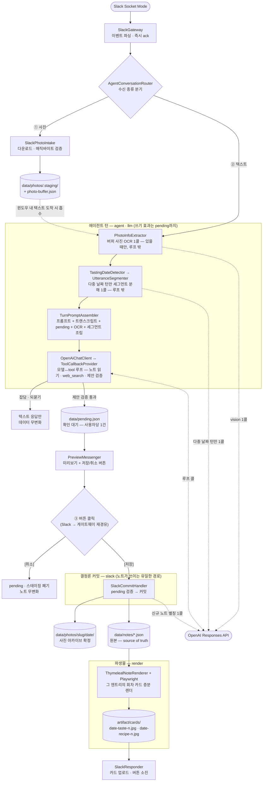
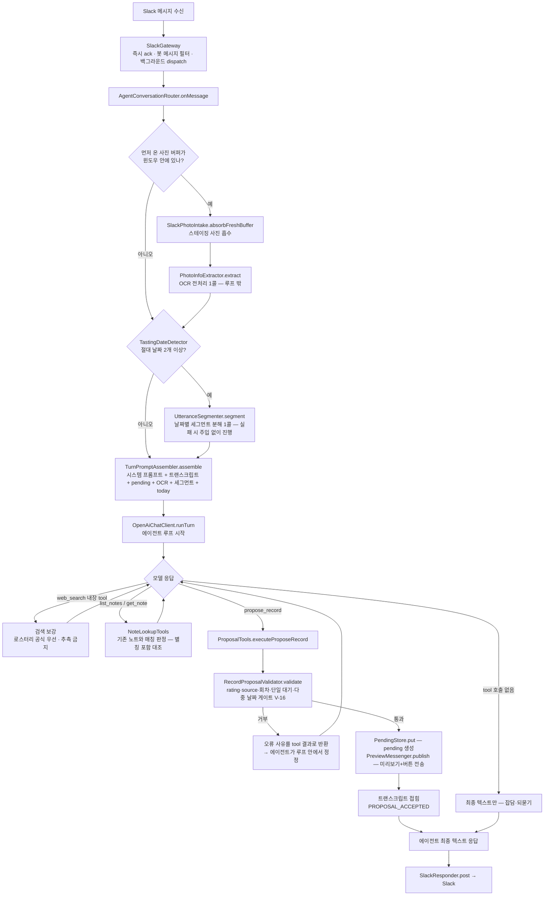
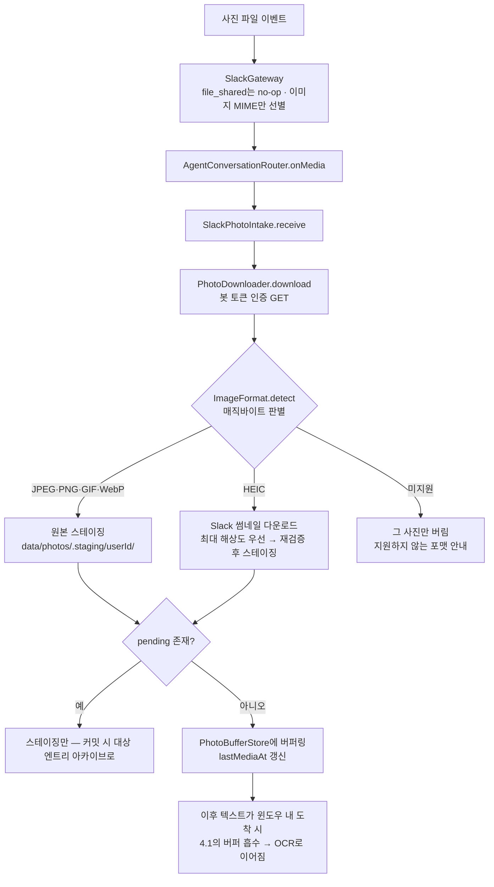
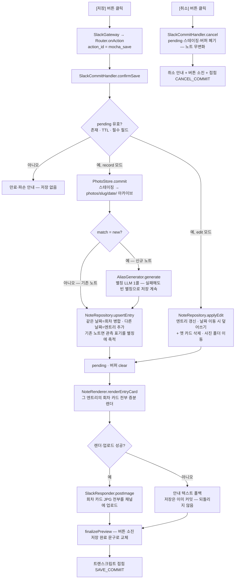
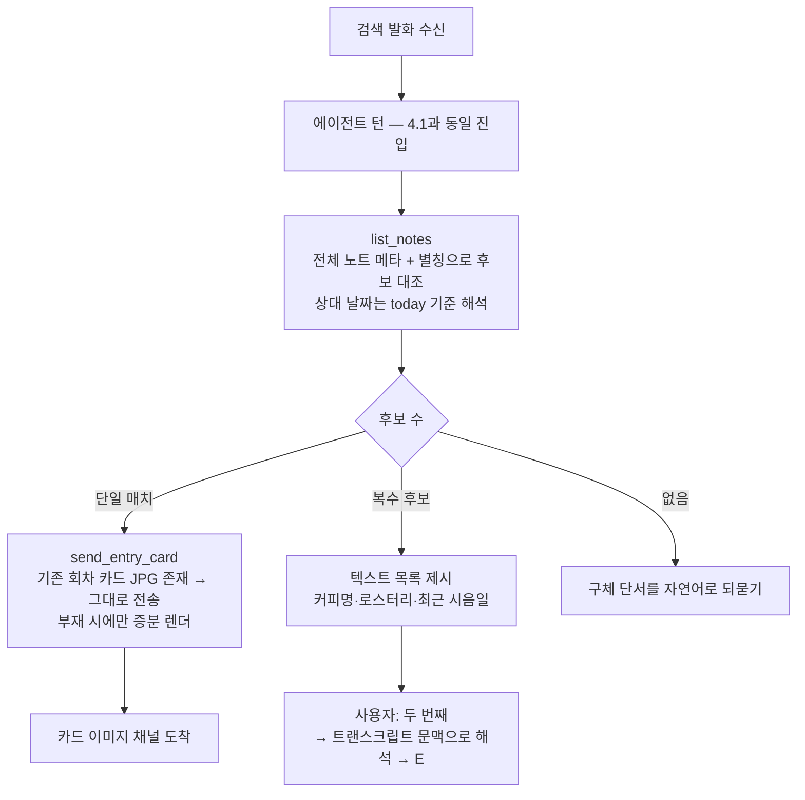
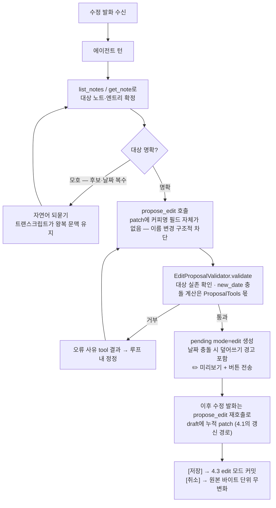
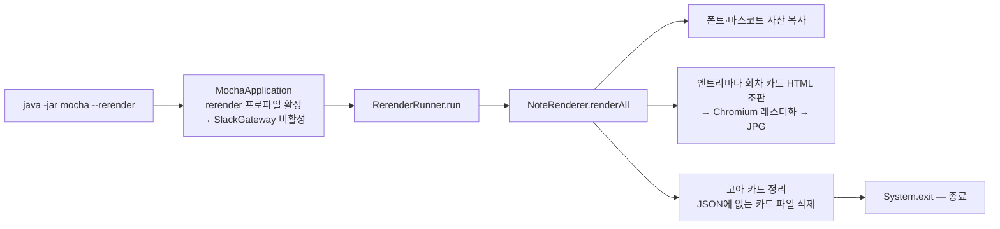
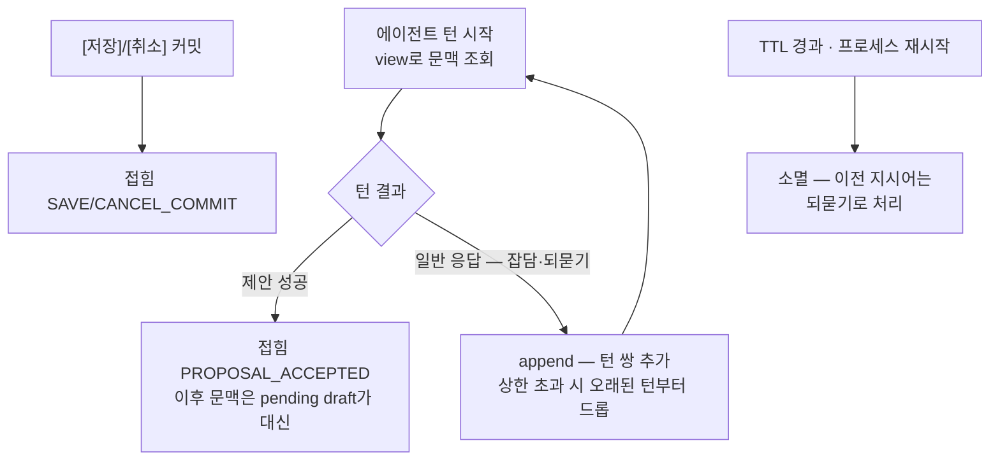

# 모카(Mocha) — 클래스 역할과 기능 흐름

> 이 문서는 `src/main/java/com/devwuu/mocha/` 전체 클래스(104개)의 역할과, 기능별 처리 흐름을 그래프로 정리한 참조 문서다.
> 소스와 spec(`specs/coffee-note-agent/`)을 기준으로 작성했으며, 도메인 특유 용어는 §1 용어 사전에 정의를 두었다. 본문에서 처음 나오는 용어는 **굵게** 표시한다.
> 에이전트 계층 공개 타입의 명명은 Spring AI 어휘에 대응한다(plan ADR-65) — 대응표는 §5가 소유한다.

---

## 목차

1. [용어 사전](#1-용어-사전)
2. [전체 아키텍처 개관](#2-전체-아키텍처-개관)
3. [패키지별 클래스 역할](#3-패키지별-클래스-역할)
4. [기능별 흐름 그래프](#4-기능별-흐름-그래프)
5. [모카 ↔ Spring AI 대응표](#5-모카--spring-ai-대응표-adr-65)

---

## 1. 용어 사전

모카는 "Slack에 자연어로 던진 커피 감상을 구조화해 로컬 JSON으로 기록하고 카드 이미지로 렌더링하는 1인용 에이전트"다. 아래 용어들은 코드 전반에 등장하며, 각 정의는 코드상 실제 의미 기준이다.

### 데이터 단위

| 용어 | 정의 |
|---|---|
| **노트(Note)** | **커피 1종**에 대한 기록 전체. `data/notes/<slug>.json` 파일 하나에 대응한다. 커피명·로스터리·원두 구성(beans) 같은 "커피의 사실"과, 날짜별 시음 기록(엔트리) 목록을 담는다. |
| **엔트리(Entry)** | 노트에 내장된 **날짜별 시음 기록 1건**(그 커피를 그 날 마신 기록). "버전 = 날짜"가 원칙이라 하루 2엔트리는 없다 — 같은 날짜에 다시 기록하면 그날 엔트리의 회차(brews)에 병합된다. |
| **회차(Brew)** | 엔트리 안의 **한 번 내려서 마신 단위** — `brews[]` 배열의 요소 1개 = `{ recipe, tasting }`. 레시피와 그 결과물의 감상이 회차 안에서 1:1로 짝지어지며(참조 필드 없음 — 구조가 짝을 표현), 배열 순서가 곧 회차 번호다(plan ADR-59). |
| **slug** | 노트의 파일명이자 식별자. `YYYY-MM-DD-HHmmss`(최초 기록일+생성 시각) 형식의 대체키다. 커피를 식별하는 값이 아니라 파일 PK — 커피의 동일성 판단은 커피명+로스터리(+별칭)가 한다. |
| **원두 구성(beans)** | 노트의 `beans[]` 배열 — 원두 1종당 `{ description(원산지·품종 자유 텍스트), process(가공방식) }`. 블렌드는 구성 원두마다 요소를 만들어 원두별 가공방식을 담는다(구 노트 레벨 origin/process 필드 대체 — plan ADR-53). |
| **official_notes(공식 노트)** | 로스터리가 상품 페이지·원두 봉투에 **전시한 테이스팅 노트**("자스민, 베르가못" 등). 사용자의 감상(`my_taste`)과 구분되는 "로스터리가 말하길" 영역이며, 로스터리 출처가 없으면 비워둔다(일반 출처 대체 금지). |
| **my_taste / my_taste_original** | 사용자가 실제로 느낀 감상 — 회차 tasting 안에 존재한다(엔트리 레벨 아님, ADR-59). `my_taste`는 한국어 음슴체로 정규화한 표시용 값("맛있더라"→"맛있었음"), `my_taste_original`은 말한 그대로의 원문 보존용 값. 항상 함께 저장되고 렌더는 정규화본만 쓴다. |
| **레시피(Recipe)** | 회차의 추출 정보 — 방식별 분기 없는 flat 10필드(`method`·`dose_g`·`water_ml`·`yield_ml`·`time_sec`·`temp_c`·`grind`·`machine`·`pouring`·`feedback`), 전 필드 nullable. 사용자 발화에서만 채우고(검색·사진 보강 금지) 언급 없는 항목은 비운다. 비율·시간 표기 같은 파생값은 저장하지 않고 렌더가 계산한다. |
| **평가(Rating)** | 4단계 범주형 단일 선택 — `완전 내스타일`/`맛있다`/`맛은 있는데 내스타일은 아님`/`맛이 없다`. 숫자 별점 없음. 회차 tasting 안에 있다(감상마다 평가가 다를 수 있음). |
| **별칭(Aliases)** | 노트의 **내부 매칭·검색 전용** 한국어 음차·이표기 목록(예: "Ethiopia Chelbesa" → "에티오피아 첼베사"). 표기가 달라도 같은 커피로 매칭하기 위한 장치로, 카드·미리보기 어디에도 표시하지 않는다. 신규 노트 첫 저장 시 LLM 1콜로 생성하고, 이후 같은 노트로 매칭된 기록의 관측 표기를 콜 없이 축적한다. |
| **출처(Source) / Sourced** | 필드 값이 어디서 왔는지 — `user`(사용자 발화) / `photo`(사진 OCR) / `search`(웹 검색). `Sourced<T>`는 값+출처를 함께 담는 래퍼다. 우선순위는 `user > photo > search`로, 하위 출처가 상위 출처 값을 덮지 못한다. beans 요소에는 서브필드 단위로 적용된다(사용자가 말한 원두에 검색이 process만 보강 가능). 미리보기에서 `(검색)`/`(사진)` 표기의 근거. |

### 확인 플로우(저장 전 대기)

| 용어 | 정의 |
|---|---|
| **pending(확인 대기)** | 에이전트가 만든 기록·수정 **제안이 사용자 [저장] 확인을 기다리는 상태**. `data/pending.json`에 영속화되어 재시작에도 생존한다. 사용자당 최대 1건(단일 대기 원칙) — 대기 중 다른 커피의 새 제안은 거부된다. TTL 초과 시 무효. |
| **draft** | pending 안의 **작성 중인 노트 사본**(아직 커밋 안 된 초안). 수정 발화가 오면 이 위에 누적 갱신된다. |
| **record 모드 / edit 모드** | pending의 두 종류. `record` = 신규 기록의 확인 대기, `edit` = 이미 저장된 노트를 고치는 수정 세션(원본 참조 `target`과 날짜 충돌 플래그를 추가로 가짐). |
| **미리보기(preview)** | pending 내용을 Slack Block Kit 메시지로 보여주는 확인 화면([저장]/[취소] 버튼 포함). `preview_ts`는 그 메시지의 타임스탬프 — 내용이 바뀌면 재전송이 아니라 같은 메시지를 edit로 갱신한다. |
| **커밋(commit)** | 사용자가 [저장] 버튼을 눌러 draft를 실제 노트 JSON 파일에 영속화하는 것. 이 확인 없이는 어떤 경로로도 노트가 쓰이지 않는다(자연어로는 커밋 불가 — 버튼 전용). |
| **버튼 소진(finalize)** | [저장]/[취소] 처리 완료 후 미리보기 메시지에서 버튼을 제거하고 "저장 완료"/"취소됨" 상태 문구로 교체하는 것. 버튼은 1회용이라 재클릭이 불가능해진다. |
| **매칭(match / MatchInfo)** | 이번 기록이 **새 노트**인지 **기존 노트의 새 시음**인지의 판정 결과. `new` 또는 `existing`(+대상 slug·날짜)으로 미리보기에 표시된다. |

### 에이전트 루프

| 용어 | 정의 |
|---|---|
| **에이전트 턴(agent turn)** | 사용자 발화 1개에 대한 처리 전체 — 전처리(OCR·다중 날짜 분해) → 컨텍스트 조립 → LLM 호출 ↔ tool 실행 루프 → 최종 텍스트 응답. 버튼 액션을 제외한 모든 수신이 에이전트 턴으로 처리된다. |
| **tool (function tool)** | 에이전트 루프에서 모델이 호출하는 실행 단위. 5종 — `list_notes`(노트 메타 목록)·`get_note`(노트 전체)·`propose_record`(신규 기록 제안)·`propose_edit`(수정 제안)·`send_entry_card`(기존 카드 재전송) — 에 OpenAI 내장 `web_search`가 더해진다. **데이터를 바꾸는 경로는 제안 tool 2종뿐이고, 그 효과도 pending 생성까지다.** |
| **제안(proposal)** | 데이터를 바꾸려는 tool 호출(`propose_record`/`propose_edit`). 서버 검증을 통과하면 pending + 미리보기가 만들어지고, 실제 저장은 [저장] 버튼이 한다. |
| **트랜스크립트(transcript)** | 에이전트 턴 **사이**의 대화 문맥(작업 트랜스크립트 — 보관소 클래스는 `FoldingChatMemory`). "그거"류 지시어, 되물음 왕복, 잡담→기록 전환을 해석하는 근거가 되는 (사용자 발화, 모카 응답) 쌍의 목록이다. 사용자당 1건, **메모리 전용**(재시작 시 소멸 — pending과 달리 파일로 남기지 않음), TTL·턴 수 상한을 가진다. |
| **턴(turn)** | 두 의미로 쓰인다. ① 트랜스크립트에 저장되는 대화 1왕복(`TranscriptTurn` = 사용자 발화 + 모카 응답 쌍), ② 위의 "에이전트 턴"(실행 1회). |
| **접힘(fold)** | 트랜스크립트를 비우는 결정론 이벤트. 제안 성공·[저장]·[취소] 시점에 접는다 — 이후 문맥은 대화 이력 대신 구조화된 pending draft가 대신하기 때문. LLM 요약 콜 없이 그냥 비운다. |
| **다중 날짜 게이트 / 세그먼트 분해** | 한 발화에 서로 다른 절대 시음 날짜가 2개 이상 섞였을 때의 이중 장치(plan ADR-60·61). 결정론 **날짜 탐지기**(정규식, 상대 날짜 제외)가 다중 날짜를 보고하면 **세그먼터**(LLM 1콜)가 원문을 날짜별로 분해해 컨텍스트에 주입하고, 에이전트는 가장 이른 날짜만 제안한다. `propose_record` 서버 검증의 게이트(V-16)가 뭉뚱그림 제안을 최종 방어한다 — edit 경로에는 적용하지 않는다(날짜 이동·정정 보호). |
| **환각 필터(hallucination filter)** | 모델이 지어낸 실존하지 않는 slug·엔트리를 대상으로 제안이 진행되지 않게 막는 서버 검사. 미존재 대상은 오류 사유를 tool 결과로 돌려줘 에이전트가 루프 안에서 정정한다. |
| **strict schema** | 제안 tool 인자의 JSON 스키마 강제(전 필드 required, additionalProperties=false). 인자의 **형태**는 스키마가, **값 수준 규칙**(rating 4범주 등)은 서버 검증(`RecordProposalValidator`·`EditProposalValidator`)이 담당한다. |
| **폴백(fallback)** | 에이전트 턴 실패 시(LLM 오류·턴 상한 3종 도달 — tool 호출 수·누적 토큰·경과 시간, plan ADR-62) 수렴하는 결정론 경로 — pending·노트를 건드리지 않고 "다시 보내달라" 안내만 하며, 사용자 원문은 파일 로그에 남아 유실되지 않는다. |

### 사진 처리

| 용어 | 정의 |
|---|---|
| **스테이징(staging)** | 수신 사진을 노트 소속이 확정되기 전 `data/photos/.staging/<userId>/`에 임시 보관하는 것. [저장] 커밋 시 아카이브로 이동하고, [취소]·만료 시 폐기된다. |
| **아카이브(archive)** | 저장 확정된 사진의 최종 위치 `data/photos/<slug>/<date>/`. 사진의 역할은 OCR 입력과 기록 보관뿐 — 카드에 렌더링하지 않고 JSON에도 경로를 기록하지 않는다(폴더 구조가 노트·날짜와의 유일한 연결). |
| **버퍼(photo buffer)** | 텍스트보다 먼저 도착한 사진을 시간 윈도우(기본 10분) 동안 묶어두는 장치(`data/photo-buffer.json`). 뒤이어 온 텍스트가 윈도우 안이면 사진이 그 기록으로 흡수된다. |
| **스윕(sweep)** | 앱 시작 시 pending·버퍼 어디에도 속하지 않는 **고아** 스테이징 파일을 청소하는 것. 살아있는 대기는 건드리지 않는다. |
| **OCR / vision 추출(VisionExtraction)** | 수신 사진에서 커피 정보(커피명·로스터리·원두 구성·로스팅·공식 노트)를 vision 모델로 읽어 구조화하는 것. 에이전트 tool이 아니라 **루프에 들어가기 전 결정론 전처리 1콜**이며, 결과는 에이전트 컨텍스트에 주입된다. 추측 금지(못 읽은 필드는 null), 실패해도 흐름은 계속된다. |
| **매직바이트 판별** | 사진 포맷을 확장자·MIME이 아닌 파일 선두 바이트로 판별하는 것. vision 지원 포맷(JPEG/PNG/GIF/WebP)만 스테이징을 통과하고, HEIC는 Slack 썸네일로 대체, 그 외는 버리고 안내한다. |

### 렌더링

| 용어 | 정의 |
|---|---|
| **회차 카드(brew card)** | 회차 파트 1건을 담은 인스타그램 4:5 비율(1080×1350) 공유용 JPG — 감상 카드(`<date>-taste-<n>.jpg`, tasting 있는 회차만)와 레시피 카드(`<date>-recipe-<n>.jpg`, recipe 있는 회차만) 2종. `n`은 회차 번호라 파일명만으로 레시피↔감상 짝이 보인다(카드 위에는 회차 미표기). Thymeleaf로 조판한 HTML을 헤드리스 Chromium으로 래스터화해 굽는다(카드 HTML 자체는 파일로 남기지 않는 중간 입력). index.html은 폐기됐다(plan ADR-55) — 산출물은 카드뿐. |
| **파생물(artifact)** | `artifact/` 아래의 카드 JPG·폰트·마스코트 자산 등 — JSON만으로 언제든 전체 재생성 가능하므로 지워도 데이터 손실이 없다. |
| **리렌더(rerender)** | JSON 원본에서 파생물 전체를 재생성하는 것. `--rerender` CLI 인자로 Slack 연결 없이 단독 실행된다. 반대로 **증분 렌더**는 저장 직후 방금 그 엔트리의 회차 카드만 굽는 것. |
| **고아 카드 정리(prune)** | 전체 리렌더 시 JSON 기준으로 더 이상 존재하지 않는 카드 파일(날짜 이동·삭제·회차 감소의 잔여물)을 삭제해 파생물을 JSON과 일치시키는 것. |
| **테마(Theme)** | 카드의 디자인 세트(type-a 세리프·명조 / type-b 귀여운·고딕+마스코트). 템플릿 폴더와 번들 폰트를 선택하며 데이터에는 영향이 없다. |

---

## 2. 전체 아키텍처 개관

**기록 1건의 일생**을 따라가면 전체 구조가 그대로 드러난다. Slack에서 오는 수신은 세 종류뿐이고(① 사진 → ② 텍스트 → ③ 버튼), 시간 순서대로 각 단계에 합류한다:

- **① 사진**(선택, 텍스트보다 먼저 올 수 있음)은 스테이징·버퍼에 대기하다가 ②에 흡수되고,
- **② 텍스트**는 에이전트 턴을 돌아 **pending(확인 대기)까지만** 쓰고 미리보기를 띄우며,
- **③ [저장] 버튼**만이 노트 JSON을 실제로 쓰고, 그 원본에서 회차 카드가 파생된다.

OpenAI SDK·Slack SDK 타입은 각각 어댑터 구현 클래스 안에만 존재하고, 나머지 코드는 인터페이스 경계만 참조한다(교체 가능성 NFR-4). 협력자 조립·전역 인스턴스(`Clock`·`ObjectMapper`) 생성은 `config/`가 소유한다(plan ADR-63). OpenAI 콜은 네 지점(점선)에서만 일어난다 — 루프·OCR·별칭에 더해, 다중 날짜 턴에만 세그먼터 1콜이 추가된다.

그림에 없는 진입로는 하나뿐이다: `--rerender` CLI(§4.6)는 Slack을 켜지 않고 `data/notes/*.json` → `artifact/` 전체 재생성만 수행한다 — 파생물은 원본에서 언제든 다시 만들 수 있다는 불변식의 실행 형태다.

핵심 불변식:

- **JSON이 유일한 원본** — 카드 JPG는 언제든 재생성 가능한 파생물이다.
- **쓰기 경로는 두 단계로 격리** — 에이전트는 제안(pending)까지만, 노트 커밋은 [저장] 버튼만 한다.
- **모든 파일 쓰기는 임시파일 → 원자적 move**.
- 트랜스크립트만 의도적으로 메모리 전용(재시작 시 소멸), pending·버퍼·스테이징은 파일로 생존.

### 2.1 대화 문맥 모델 — 무상태 API 위에서 연속성 만들기

에이전트 관련 클래스(`FoldingChatMemory`·`TurnPromptAssembler` 등)가 왜 이런 모양인지는 하나의 전제에서 전부 따라 나온다:

> **LLM API는 무상태(stateless)다.** 모델은 이번 요청에 실려 온 것만 보고 응답하며, 요청이 끝나면 서버는 그 대화를 기억하지 않는다. "모카가 이전 대화를 기억한다"는 감각은 전부 **클라이언트(모카)가 매 턴 이전 문맥을 다시 조립해 실어 보내서** 만들어진다.

이 전제 위에서 구성요소별 존재 이유:

1. **컨텍스트 = 이번 턴에 모델이 보는 것 전부.** 매 턴 `TurnPromptAssembler`가 처음부터 다시 조립한다 — 시스템 프롬프트(항구 정책) + 턴 컨텍스트(today·pending draft·OCR·다중 날짜 세그먼트라는 동적 사실) + 트랜스크립트(이전 대화 이력을 messages로 재구성) + 이번 발화. 어느 재료도 서버에 남아 있지 않으므로, 매 턴 전송분이 곧 모델의 기억 전체다.

2. **트랜스크립트 = 턴 사이 연속성의 유일한 근거.** API가 기억하지 않으므로 "그거"류 지시어·되물음 왕복은 클라이언트가 이력을 보관했다가 재전송해야만 해석된다. `FoldingChatMemory`가 그 보관소다. 단, 전체 로그가 아니라 (사용자 발화, 모카 최종 응답) 쌍만 남긴다 — 턴 내부의 tool 호출·중간 과정은 다음 턴 해석에 불필요하므로 처음부터 싣지 않는 압축 저장이다.

3. **예외 — 한 턴 안의 tool 루프는 서버가 이어준다.** OpenAI Responses API의 `previous_response_id`로, `OpenAiChatClient`는 루프 이터레이션마다 이전 내용 전체를 재전송하는 대신 응답 id + function_call_output만 싣는다. 이 서버측 연속성의 수명은 턴 하나다 — `runTurn`이 끝나면 버려지고, 턴과 턴 사이는 완전한 무상태로 돌아간다.

4. **문맥은 무한히 커질 수 없으므로 접는다 — 단, 결정론적으로.** 범용 에이전트(예: Claude Code)가 컨텍스트가 길어지면 LLM 요약으로 압축(compaction)하는 것과 같은 문제를, 모카는 LLM 판단 없이 관측 가능한 이벤트만으로 푼다: 제안 성공·[저장]/[취소] 시 접힘(fold), 턴 상한 초과 시 오래된 턴 드롭, TTL 경과 시 소멸. 접힘이 가능한 이유는 **구조화된 pending draft가 이후 문맥의 압축본 역할을 대신하기** 때문이다 — 요약 콜 없이도 "지금까지 합의된 내용"이 draft로 남는다. (요약 비도입은 의도된 right-sizing — 문맥 절단 불편이 실제 관측되면 재론, plan.md §6.) 클래스명 `FoldingChatMemory`의 `Folding` 수식어가 바로 이 차이다 — 범용 ChatMemory와 달리 결정론 접힘 규칙을 가진다(ADR-65 ②).

재료별 보관 주체와 수명으로 정리하면:

| 컨텍스트 재료 | 보관 주체 | 수명 |
|---|---|---|
| 시스템 프롬프트 | `AgentSystemPrompt` (코드 상수) | 영구 |
| today·타임존 | `Clock` (config 공통 빈, 조립 시점 평가) | 턴 1회 |
| pending draft | `data/pending.json` (파일) | [저장]/[취소] 커밋 또는 TTL |
| OCR 결과 | 턴 내 전처리 산물 (미보관) | 턴 1회 |
| 다중 날짜 세그먼트 | 턴 내 전처리 산물 (미보관) | 턴 1회 |
| 대화 이력 | `FoldingChatMemory` (메모리) | 접힘·턴 상한·TTL·재시작 |
| 이번 발화 | Slack 수신 | 턴 1회 |
| 턴 내 tool 루프 상태 | OpenAI 서버 (`previous_response_id`) | 턴 1회 |

---

## 3. 패키지별 클래스 역할

### 3.1 `slack` — 수신 진입·분기·커밋 (5개)

| 클래스 | 종류 | 역할 |
|---|---|---|
| `SlackGateway` | class | Slack Socket Mode 수신 진입점. Bolt 이벤트를 내부 값객체(`Incoming*`)로 파싱해 라우터에 넘기는 얇은 계층으로, 즉시 ack + 백그라운드 처리로 재전송 루프를 막고 봇 자신의 메시지를 걸러 에코 루프를 차단한다. Slack SDK 타입이 이 클래스 밖으로 새지 않는다. `--rerender` 프로파일에서는 비활성. |
| `ConversationRouter` | interface | 수신 이벤트(메시지/버튼/사진)를 받는 라우팅 경계. 게이트웨이(파싱)와 분기 로직을 분리한다. |
| `AgentConversationRouter` | class | 메인 라우터. 협력자는 config(`RouterConfig`)가 조립해 주입한다 — 생성자 1종, 협력자 `new` 0건(ADR-63). 텍스트는 [사진 버퍼 흡수 → OCR 전처리 → 다중 날짜 탐지·세그먼트 분해(해당 턴만) → 컨텍스트 조립 → 에이전트 턴 → 응답]으로, 버튼은 `SlackCommitHandler` + 커밋 접힘으로, 사진은 `SlackPhotoIntake`로 보낸다. 턴 실패 시 pending·노트 무변화 + 폴백 안내로 수렴시키는 지점이기도 하다. |
| `SlackCommitHandler` | class | **[저장]/[취소] 버튼의 커밋 전담.** 저장 시: pending 검증(TTL 등) → 스테이징 사진 아카이브 이동 → (신규 노트면) 별칭 생성 1콜 → 노트 JSON 커밋 → 회차 카드 증분 렌더 + Slack 업로드 → 버튼 소진. 취소 시: pending·스테이징 폐기 + 안내. 사용자 확인 없이는 절대 노트를 쓰지 않는다는 정책의 구현 지점. |
| `StagingSweeper` | class | 앱 시작 시 1회 실행되는 스윕 훅 — pending·버퍼 어디에도 속하지 않는 고아 스테이징 사진만 청소한다. |

### 3.2 `slack.inbound` — 수신 값객체·사진 유입 (8개)

| 클래스 | 종류 | 역할 |
|---|---|---|
| `IncomingMessage` | record | 평문 메시지의 내부 표현 (userId·channelId·text·ts). |
| `IncomingAction` | record | 버튼 액션의 내부 표현. `actionId`로 저장/취소를 구분하고 `messageTs`가 버튼 소진 대상 미리보기를 가리킨다. |
| `IncomingMedia` | record | 사진 묶음 수신의 내부 표현. `ts`가 버퍼 그룹핑 기준 시각. |
| `IncomingPhoto` | record | 사진 1건 (url·파일명·MIME·썸네일 후보 목록). HEIC 대체용 썸네일 URL을 최대 해상도 우선으로 싣는다. |
| `PhotoDownloader` | interface | "URL → 바이트" 사진 다운로드 경계(HTTP·토큰 세부 은닉). |
| `SlackPhotoDownloader` | class | 구현체 — Slack `url_private`를 봇 토큰 Bearer 인증으로 GET. 실패는 `PhotoDownloadException`으로 수렴. |
| `PhotoDownloadException` | exception | 사진 다운로드 실패 신호. 상위에서 "안내 + pending 미생성" 실패 모드로 처리된다. |
| `SlackPhotoIntake` | class | **사진 유입 경로 전담.** 다운로드 → 매직바이트 포맷 검증(HEIC는 썸네일 대체, 미지원은 버리고 안내) → 스테이징 → 버퍼 그룹핑. 텍스트 턴에서 버퍼를 흡수해 OCR(`readPhotoInfo`)을 트리거하고, 커밋 시 스테이징→아카이브 이동·날짜 이동 동반 이동도 수행한다. |

### 3.3 `slack.outbound` — 응답·미리보기 송신 (5개)

| 클래스 | 종류 | 역할 |
|---|---|---|
| `SlackResponder` | interface | 결과 통지 송신 경계 — 안내 텍스트(`post`), 카드 JPG 업로드(`postImage`), 버튼 소진(`finalizePreview`). 에이전트 tool 계층도 응답 창구로 재사용한다. |
| `SlackApiResponder` | class | 구현체 — Slack MethodsClient로 chatPostMessage / filesUploadV2 / chatUpdate 실행. 카드 업로드 실패만 예외로 던져 호출부가 텍스트 폴백하게 한다. |
| `PreviewMessenger` | class | 미리보기 전송/갱신 어댑터 — `preview_ts` 유무에 따라 신규 전송 또는 같은 메시지 edit. 제안 tool이 미리보기를 보내는 창구. |
| `PreviewBlocks` | class | pending → 미리보기 Block Kit 변환 순수 함수. 출처 태그(`(검색)`/`(사진)`), edit 모드 ✏️ 헤더, 날짜 충돌 경고, [저장]/[취소] 버튼, 버튼 소진 후 블록까지 조립한다. |
| `MochaMessages` | final class | 모카(강아지 "~멍" 톤) 사용자 안내 문구 상수 모음(저장 완료·취소·폴백·포맷 미지원 등). |

### 3.4 `agent` — 루프 드라이버 (3개)

| 클래스 | 종류 | 역할 |
|---|---|---|
| `ChatClient` | interface | 에이전트 루프 드라이버의 경계(Spring AI 원명 채택 — ADR-65 ①). "모델↔tool 루프를 상한까지 돌리고 최종 텍스트를 반환한다"는 계약만 정의 — 루프 밖 코드가 OpenAI SDK를 모르게 한다. |
| `OpenAiChatClient` | class | OpenAI Responses API 기반 구현체. 모델 호출 → function call 수집 → tool 실행 → 결과를 다음 입력에 실어 재호출을 반복하고, tool 호출이 없는 응답이 오면 그 텍스트로 턴을 마친다. 턴 상한 3종(tool 호출 수·누적 토큰·경과 시간 — ADR-62) 검사, 미등록 tool·실행 오류를 `{"error": 사유}` tool 결과로 돌려주는 정정 루프, 내장 web_search 관측·누적 usage 로그를 담당한다. |
| `AgentException` | exception | 턴 실패 신호(모델 오류·상한 도달). 라우터가 이를 받아 결정론 폴백으로 수렴시킨다. |

### 3.5 `agent.conversation` — 대화 문맥 (2개)

| 클래스 | 종류 | 역할 |
|---|---|---|
| `FoldingChatMemory` | class | 작업 트랜스크립트 보관소 — 사용자당 1건, 메모리 전용. 턴 추가(`append`, 상한 초과 시 오래된 턴 드롭), 조회(`view`, TTL 경과 시 소멸 — 다음 접근 시점 지연 판정), 접힘(`clear` — 중첩 enum `FoldTrigger`가 배선 지점을 정의: 제안 성공은 tool 구현체, [저장]/[취소]는 `AgentConversationRouter`의 버튼 분기 `onAction`)을 제공한다. `Folding` 수식어 = 결정론 접힘 규칙(ADR-46)이 범용 ChatMemory와 다름을 명시(ADR-65 ②). |
| `TranscriptTurn` | record | 트랜스크립트의 턴 1건 = (사용자 발화, 모카 응답) 쌍. |

### 3.6 `agent.prompt` — 턴 입력 조립 (3개)

| 클래스 | 종류 | 역할 |
|---|---|---|
| `AgentSystemPrompt` | final class | 시스템 프롬프트의 단일 소유 지점 — 모카 페르소나, 대화 경계(커피 무관 발화엔 tool 금지), 언어 정책(고유명사 원문 유지·my_taste 음슴체), 출처 우선순위, 웹 검색 보강 규칙을 텍스트로 인코딩. |
| `TurnPromptAssembler` | class | 턴 컨텍스트 조립기 — 트랜스크립트 + pending draft 요약 + OCR 결과 + 다중 날짜 세그먼트 + 오늘 날짜(Asia/Seoul)를 시스템 프롬프트에 덧붙이고, 대화 이력을 메시지 목록으로 재구성해 `TurnPrompt`를 만든다. |
| `TurnPrompt` | record | 턴 1회의 입력 (instructions + 메시지 목록). SDK 무관 경계 타입. 메시지 1건은 중첩 record `TurnPrompt.Message`(Role: USER/MOCHA + 내용 — 중첩으로 포함 관계를 이름에 노출, ADR-64 ③) — 드라이버가 SDK 메시지로 변환한다. |

### 3.7 `agent.turn` — 턴 하네스(전처리·컨텍스트 운반) (2개)

> changes/0024(ADR-64)에서 신설 — tool 패키지는 "모델에 장착되는 tool 정의 + 인자 record + 검증"만 담고, 툴이 아닌 턴 하네스 구조물은 여기 둔다.

| 클래스 | 종류 | 역할 |
|---|---|---|
| `TastingDateDetector` | final class | 결정론 시음 날짜 탐지기 — 사용자 원문에서 **절대 날짜 표기만**(연도 포함 숫자·"7/18" 축약·한국어 "7월 18일") 정규식으로 세어 정렬 집합을 돌려준다. 상대 날짜("어제")는 오탐 방지를 위해 세지 않는다. 다중 날짜 게이트(V-16)와 자동 분해 트리거(ADR-61, 라우터)가 공유하는 순수 유틸 — LLM·I/O 무관. |
| `TurnUserMessage` | record | 턴의 사용자 원문(+날짜별 세그먼트)을 제안 검증기까지 나르는 SDK 무관 홀더 — 다중 날짜 게이트의 판정 입력. 라우터가 턴 시작 시 1회 만들어 tool 조립(`ToolCallbackProvider.forTurn`)에 넘기므로 턴 안에서 원문·세그먼트가 일관된다. 세그먼트는 중첩 record `Segment`(date + 원문 무편집 발췌). |

### 3.8 `agent.tool` — function tool 정의·실행 (15개)

| 클래스 | 종류 | 역할 |
|---|---|---|
| `ToolCallback` | record | tool 1종의 정의+실행기 (이름·설명·인자 스키마·`Executor`). Executor는 "인자 JSON → 결과 JSON" 함수형 인터페이스. Spring AI 원명 채택(ADR-65 ①). |
| `ToolCallbackProvider` | class | tool 5종의 façade — 읽기 tool(`NoteLookupTools`)과 쓰기 tool(`ProposalTools`)을 조립하고, 턴마다 userId(pending 소유자)·channelId(배달처)·`TurnUserMessage`(게이트 판정 입력)를 바인딩한 tool 목록을 공급한다(`forTurn`). |
| `NoteLookupTools` | class | **읽기 tool 3종**: `list_notes`(전체 노트 메타+별칭 — 매칭·검색의 출발점), `get_note`(노트 전체, 미존재 slug는 오류 = 환각 필터), `send_entry_card`(기존 회차 카드 JPG 재전송, 파일 부재 시에만 증분 렌더). 노트·pending 파일을 절대 바꾸지 않는다. |
| `ProposalTools` | class | **쓰기 제안 tool 2종**: `propose_record`(신규 기록 제안)·`propose_edit`(저장 노트 수정 제안). 인자 파싱 → 서버 검증(진입점 2종에 위임) → pending 생성/갱신 → 미리보기 전송 → 트랜스크립트 접힘까지가 효과의 전부(커밋은 버튼만). strict schema 문자열도 여기서 정의한다. 날짜 이동 충돌(V-10) 계산도 이 제안 수용 지점의 몫. |
| `ToolSupport` | final class | tool 공용 유틸 — 오류 결과 형태(`{"error":...}`) 통일, slug 리졸브. |
| `GetNoteArgs` / `SendEntryCardArgs` | record | 읽기 tool 인자 값객체. |
| `ProposeRecordArgs` / `ProposeEditArgs` | record | 제안 tool 인자의 미검증 원시형. `ProposeEditArgs.Patch`에는 커피명 필드 자체가 없어 이름 변경이 구조적으로 불가능하다. |
| `SourcedArg<T>` | record | 출처 표시 필드의 미검증 원시형(source가 String) — 검증 후 도메인 `Sourced`(enum)로 승격된다. |
| `BeanArg` / `BrewArg` | record | beans(원두 구성)·brews(회차) 인자의 미검증 원시형 — 검증 후 도메인 `Bean`·`Brew`로 승격된다(changes/0021). |
| `NoteSummary` | record | `list_notes` 응답 항목(slug·커피명·로스터리·별칭·원두 구성 요약·공식 노트·최근 시음일). |
| `RecordProposal` / `EditProposal` | record | 검증 통과 후 정규화된 도메인 제안 — pending draft 조립·갱신의 입력. |

### 3.9 `agent.tool.validation` — 제안 서버 검증 (8개)

> changes/0024(ADR-64)에서 신설 — 진입점은 **툴 축**(새 툴 추가 시 파일 1개씩 성장), 공유 규칙은 패밀리 클래스로. 새 인터페이스 도입 없음(`ToolValidation`은 기존 sealed interface의 이동 — REVIEW.md §2 표 불변), 위반은 예외가 아니라 **사유 있는 거부**로 수렴해 에이전트가 루프 안에서 정정한다.

| 클래스 | 종류 | 역할 |
|---|---|---|
| `RecordProposalValidator` | class | `propose_record` 서버 값검증 진입점 — 공유 패밀리 위임 + 진입점 고유 검증(필수 날짜, 다중 날짜 게이트 V-16 — record 전용·연도 없는 표기 해석용 Clock 주입). |
| `EditProposalValidator` | class | `propose_edit` 서버 값검증 진입점 — 공유 패밀리 위임 + 진입점 고유 검증(대상 엔트리 실존 = 환각 필터, 교체 결과 회차 0개 거부, 같은 날짜 이동의 null 정규화). |
| `SourceRules` | final class | 출처 규칙 패밀리(V-5·V-14) — 출처 인자를 도메인 `Sourced`로 정규화, 커피명은 user/photo만·beans 요소 정규화. 양 진입점 공유. |
| `BrewRules` | final class | 회차 규칙 패밀리(V-1·V-8·V-15) — brews 인자를 도메인 `Brew` 배열로 정규화(rating 4범주·레시피 정규화·빈 회차 드롭). 양 진입점 공유. |
| `SinglePendingGate` | final class | 단일 대기 게이트 패밀리 — 확인 대기 중 다른 대상의 제안을 거부하고, 같은 대상의 재호출만 FR-5 갱신 경로로 통과시킨다. |
| `ValidationSupport` | final class | 규칙 패밀리 공용 조각 — 빈 값 위생·날짜 파싱(YYYY-MM-DD) 헬퍼. |
| `ToolValidation<T>` | sealed interface | 검증 결과 타입 — `Ok(값)` 또는 `Rejected(사유)`. |
| `RejectedException` | exception | 사유를 담아 `Rejected`로 수렴하는 패키지 내부 신호 — 진입점이 잡아 거부 결과로 변환한다. |

### 3.10 `llm` — 루프 밖 보조 LLM 콜 (9개)

| 클래스 | 종류 | 역할 |
|---|---|---|
| `AliasGenerator` | interface | 별칭 생성 경계 — 커피명·로스터리를 받아 한국어 음차·이표기를 반환. 신규 노트 첫 저장 시 노트당 평생 1회만 호출되며, 실패해도 빈 별칭으로 수렴(저장은 유지). |
| `OpenAiAliasGenerator` | class | 구현체 — 최경량 텍스트 모델에 structured output(strict schema)으로 별칭 배열을 받는다. |
| `VisionClient` | interface | 이미지 → 커피 정보 구조화(OCR)의 경계. |
| `OpenAiVisionClient` | class | 구현체 — vision 모델에 이미지(`detail=HIGH`)와 strict schema를 보내 커피 정보를 받는다. 추측 금지(미확인 null), 모든 실패는 빈 결과로 수렴. |
| `PhotoInfoExtractor` | class | OCR 전처리 오케스트레이터 — 스테이징 사진들을 **1회 호출**로 읽는다. 장수 상한 초과분은 제외하고, 로컬 바이트를 `data:` URI로 인코딩해 넘긴다(Slack URL은 인증이 필요해 OpenAI가 직접 못 읽음). MIME은 매직바이트로 판별. |
| `UtteranceSegmenter` | interface | 다중 날짜 발화 세그먼트 분리 경계 — 탐지기가 절대 날짜 2개 이상을 찾은 턴에만 루프 전 1콜(ADR-61). 분리만 한다(요약·번역·필드 추출 금지 — 원문 보존 분할). 실패는 예외로 알리고 호출부가 "분리 안내" 폴백으로 수렴(기록 비차단, 게이트가 방어). |
| `OpenAiUtteranceSegmenter` | class | 구현체 — Responses API structured output(strict schema), 전용 경량 키 `mocha.agent.segmenter-model`. |
| `VisionExtraction` | record | OCR 결과 값객체(미확인은 null). `empty()`가 실패·무정보의 표준 수렴값. |
| `VisionHint` | record | OCR 문맥 힌트(이미 아는 커피명·로스터리) — 오독을 줄이는 용도. 사진만 온 흐름에서는 둘 다 null. |

### 3.11 `render` — JSON → 회차 카드 (11개)

| 클래스 | 종류 | 역할 |
|---|---|---|
| `NoteRenderer` | interface | 렌더 경계 — 전체 리렌더(`renderAll`), 엔트리의 회차 카드 증분 렌더(`renderEntryCard` — 그 엔트리의 카드 전부를 List로 반환), 카드 삭제(`removeEntryCard`, 날짜 이동 시). |
| `ThymeleafNoteRenderer` | class | 주 구현체 — 노트 JSON을 읽어 회차마다 감상 카드(tasting 있는 회차)·레시피 카드(recipe 있는 회차) HTML을 Thymeleaf로 조판해 JPG로 굽고, 고아 카드를 정리한다. 폰트·마스코트 자산 복사도 담당. index.html은 산출하지 않는다(ADR-55 — artifact/ 아래 HTML 산출 금지). |
| `CardImageRenderer` | interface | "카드 HTML → JPG 래스터화" 경계. |
| `PlaywrightCardImageRenderer` | class | 구현체 — Playwright 헤드리스 Chromium으로 1080×1350 뷰포트 스크린샷을 JPG로 저장(순수 Java로는 flexbox·이모지·웹폰트 렌더가 불가능해 실제 브라우저 엔진 사용). 오프라인 컨텍스트로 CDN 미의존을 강제. |
| `CardFiles` | final class | 회차 카드 JPG 경로 규약(`cards/<slug>/<date>-taste-<n>.jpg`·`-recipe-<n>.jpg`)의 단일 소유 — 렌더러(산출·정리)와 `send_entry_card`(파생물 재사용 판정)가 공유한다. |
| `NoteView` | final class | 템플릿용 뷰 모델 컨테이너 — `TasteCard`(감상 카드)·`RecipeCard`(레시피 카드) 등 중첩 record. 카드 단위 = 회차 파트 1건. |
| `KoreanDates` | final class | 템플릿 헬퍼 — 한국어 날짜 포맷("2026년 7월 10일" 등). |
| `RatingStyle` | final class | 템플릿 헬퍼 — 평가 4범주의 배지 색상. |
| `RecipeAmounts` | final class | 템플릿 헬퍼 — 레시피 수량·파생 표기(15.0→"15", 비율 1:N, "N분 N초"). 파생값은 저장하지 않고 렌더 시 계산한다(ADR-1). |
| `Theme` | enum | 렌더 테마(TYPE_A 세리프·명조 / TYPE_B 귀여운·고딕+마스코트) — 템플릿 폴더와 번들 폰트 선택. |
| `RerenderRunner` | class | `--rerender` CLI 진입점 — 전체 리렌더 후 종료. 이 프로파일에서는 Slack 게이트웨이가 비활성이라 상주 인스턴스와 무관하게 안전하다. |

### 3.12 `domain` — 도메인 모델 (14개)

| 클래스 | 종류 | 역할 |
|---|---|---|
| `Note` | record | 커피 1종의 최상위 애그리게이트 — slug, 커피명·로스터리·로스팅 정도(출처 표시), 원두 구성(`beans`), 공식 노트, 별칭, 검색 출처 링크, 엔트리 목록, 타임스탬프. |
| `Bean` | record | 원두 1종(`Note.beans` 요소) — description(원산지·품종 자유 텍스트)+process(가공방식), 각각 `Sourced`. V-14 정규화(빈 요소만 드롭) 내장. |
| `Entry` | record | 날짜별 시음 기록 1건 — 날짜(entries 내 유일 키)·회차 배열 `brews`·갱신 시각. 구 엔트리 레벨 감상·평가·레시피 단일 필드는 폐지(ADR-59 — 회차 안에만). |
| `Brew` | record | 회차 1개(`Entry.brews` 요소) — recipe·tasting 1:1 쌍(둘 중 하나만도 허용, 둘 다 null이면 드롭). V-15 정규화 내장. |
| `Tasting` | record | 회차 맛 감상 — my_taste(+원문 병존 불변식 내장)·rating. |
| `Recipe` | record | 회차 추출 레시피 — flat 10필드 전부 nullable + 정규화 로직. 사용자 발화 전용(source 개념 없음). |
| `Sourced<T>` | record | 값+출처 래퍼. |
| `Source` | enum | 출처 3종(user/photo/search). 정의 외 값은 역직렬화 거부. |
| `Rating` | enum | 평가 4범주. 한국어 라벨로 직렬화. |
| `Aliases` | record | 별칭 목록 + 축적 로직 — 관측 표기 병합(`accumulate`), 정규화(소문자화·공백 제거) 기준 중복 제거. 정규화는 대조 기준일 뿐 저장값은 첫 등장 표기를 보존. |
| `NoteMeta` | record | 노트에서 slug·엔트리·타임스탬프를 뺀 "커피의 사실" 묶음 — 신규 노트 생성 입력. |
| `MatchInfo` | record | 매칭 판정 결과(new / existing+slug+date). |
| `PendingNote` | record | 확인 대기 상태 — 모드(record/edit)·draft·수정 대상(target)·날짜 충돌 플래그·매칭·preview_ts·생성 시각. 필드 하나만 바꾼 사본을 만드는 `withX` 메서드 제공. |
| `PhotoBuffer` | record | 사진 버퍼 상태 — 마지막 수신 시각(윈도우 판정 기준)과 스테이징 파일명 목록. |

### 3.13 `repository` — 파일 저장소 (9개)

모든 구현체 공통: 쓰기는 임시 `.tmp` 파일 → 원자적 move, 시계·직렬화는 config 공통 빈(`Clock` Asia/Seoul·`ObjectMapper` — ADR-63) 주입.

| 클래스 | 종류 | 역할 |
|---|---|---|
| `NoteRepository` | interface | 노트 저장소 경계 — 전체/단건 조회, 충돌 없는 slug 발급, 엔트리 병합 저장(`upsertEntry`), 수정 커밋(`applyEdit`). |
| `JsonFileNoteRepository` | class | 구현체 — `data/notes/<slug>.json` 읽기/쓰기. 같은 날짜는 회차 병합·다른 날짜는 엔트리 추가(하루 2엔트리 금지), 신규 노트에는 별칭 심기·기존 노트에는 관측 표기 축적, 수정 커밋 시 커피명 불변 이중 방어와 날짜 이동 덮어쓰기 처리. |
| `PendingStore` | interface | pending 저장소 경계 — put/get/clear. |
| `JsonFilePendingStore` | class | 구현체 — `data/pending.json` 단일 파일. TTL 초과분은 get에서 빈 값으로 수렴(만료 pending은 유효 대기가 아님). |
| `PhotoBufferStore` | interface | 사진 버퍼 저장소 경계 — put/get/clear. |
| `JsonFilePhotoBufferStore` | class | 구현체 — `data/photo-buffer.json`. 윈도우 판정은 저장소가 아니라 수신 경로가 한다. |
| `PhotoStore` | interface | 사진 파일 저장소 경계 — 스테이징(`stage`/`readStaged`/`discard`), 아카이브 확정(`commit`), 날짜 이동(`moveEntryPhotos`), 고아 청소용 사용자 목록(`stagedUserIds`). |
| `LocalPhotoStore` | class | 구현체 — `data/photos/.staging/<userId>/`(임시)와 `data/photos/<slug>/<date>/`(확정) 레이아웃 관리. 파일명 안전화·충돌 시 `-N` 유일화. |
| `StagedImage` | record | 스테이징 사진 1장(파일명+바이트) — OCR의 입력 단위. |

### 3.14 `config` · 기타 (10개)

| 클래스 | 종류 | 역할 |
|---|---|---|
| `CommonConfig` | @Configuration | 전역 성격 공통 빈(ADR-63) — `Clock`(Asia/Seoul)·`ObjectMapper`(`MochaObjectMapper.create()`) 각 1빈. 프로덕션에서 이 둘의 직접 생성은 여기뿐이다. |
| `RouterConfig` | @Configuration | 에이전트 턴 협력자 배선(ADR-63) — 검증기 2종·`TurnPromptAssembler`·`ToolCallbackProvider`·`SlackPhotoIntake`·`SlackCommitHandler`를 조립한다. "누가 무엇으로 조립되는가"가 이 한 클래스에서 읽힌다. |
| `RepositoryConfig` | @Configuration | 저장소 4종 빈 조립. 경로는 전부 `mocha.data.dir`에서만. |
| `LlmConfig` | @Configuration | OpenAI 클라이언트 + 보조 콜(vision·별칭) 빈 조립. 역할별 모델 키 분리(`mocha.vision.model`·`mocha.alias.model`). |
| `AgentConfig` | @Configuration | 에이전트 루프 드라이버(`mocha.agent.model`·상한 3종 키)와 트랜스크립트(턴 상한·TTL), 세그먼터(`mocha.agent.segmenter-model`) 빈 조립. |
| `RenderConfig` | @Configuration | Thymeleaf 오프라인 템플릿 엔진 + 렌더러 빈 조립(`mocha.artifact.dir`·테마). |
| `SlackConfig` | @Configuration | Slack 송신용 MethodsClient 빈(봇 토큰). 수신(Socket Mode)은 게이트웨이가 앱 토큰으로 별도 배선. |
| `MochaObjectMapper` | final class | 도메인 JSON 직렬화 규칙의 단일 출처 — snake_case, 타임존 오프셋 보존. 인스턴스 생성은 `CommonConfig` 빈이 소유(ADR-63). |
| `ImageFormat` | enum | 매직바이트 이미지 포맷 판별(JPEG/PNG/GIF/WebP=vision 지원, HEIC=썸네일 대체, UNKNOWN=거부). |
| `MochaApplication` | class | Spring Boot 진입점. `--rerender` 인자 시 rerender 프로파일(리렌더 후 종료), 아니면 Slack 상주 모드. |

---

## 4. 기능별 흐름 그래프

### 4.1 신규 기록: 텍스트 수신 → 미리보기 (FR-1·2·3·14·22)

"커피베라 예가체프 마셨는데 새콤하고 좋았다" 한 줄이 미리보기에 도달하기까지.

- 턴 상한 3종(tool 호출 수 `mocha.agent.max-tool-calls`·누적 토큰·경과 시간 — ADR-62)에 닿거나 LLM 호출이 실패하면 `AgentException` → 라우터의 결정론 폴백(pending·노트 무변화, "다시 보내달라" 안내, 원문은 로그 보존).
- pending이 이미 있는데 **다른 커피**의 새 기록이 오면 서버가 제안을 거부하고 "먼저 저장/취소" 사유를 tool 결과로 돌려준다(단일 대기 원칙). **같은 커피**의 재호출은 pending 갱신 경로로 통과한다 — 이것이 곧 pending 수정(FR-5) 메커니즘.
- 다중 날짜 턴은 에이전트가 **가장 이른 날짜 세그먼트만** 제안하고 나머지는 "저장 후 이어서"로 안내한다(ADR-61) — 이어가기 상태는 트랜스크립트에만 의존한다.

### 4.2 사진 수신·버퍼링·OCR (FR-10·19)

- OCR은 에이전트 tool이 아니라 루프 전 결정론 전처리다: 스테이징 바이트를 `data:` URI로 인코딩해 vision 1콜, 결과(`VisionExtraction`)는 에이전트 컨텍스트에 주입되어 `source=photo` 값과 매칭 재료가 된다. 못 읽으면 첨부로만 처리(흐름 불변).
- 앱 시작 시 `StagingSweeper`가 pending·버퍼 어디에도 안 걸린 고아 스테이징만 청소한다.

### 4.3 [저장]/[취소] 버튼 커밋 (FR-4·6·7·16)

노트 파일이 실제로 쓰이는 유일한 순간. 에이전트를 거치지 않는 결정론 경로다.

### 4.4 노트 검색·카드 재전송 (FR-20)

"저번에 마신 예가체프 있잖아" — 데이터를 바꾸지 않는 읽기 흐름.

- 검색 중에도 확인 대기 중인 pending은 절대 변하지 않는다(읽기 tool은 파일을 못 바꿈 — 격리).

### 4.5 저장된 노트 수정 (FR-21)

"그거 날짜 엊그제로 바꿔줘" — 기존 노트를 고치는 ✏️ 수정 세션.

### 4.6 전체 리렌더 (NFR-3)

파생물을 지웠거나 디자인을 바꿨을 때 JSON만으로 복구하는 CLI 흐름.

### 4.7 트랜스크립트 생애주기 (FR-23)

트랜스크립트가 왜 존재하고 왜 이렇게 접히는지의 전제(무상태 API·결정론 접힘)는 §2.1 참조.

---

## 5. 모카 ↔ Spring AI 대응표 (ADR-65)

에이전트 계층 공개 타입의 명명은 Spring AI 2.0 어휘에 대응시킨다 — **개명 결정과 3규칙은 plan ADR-65가, 대응 관계 전체 표(대응 없음 명시 포함)는 이 §5가 소유한다**(ADR-65의 구→신 나열은 결정 시점의 이력 기록). 기준 3규칙: ① 역할·의미 일치 = 원명 채택, ② 역할 대응·의미 상이 = Spring AI 어휘 + 차이 수식어(거짓 동의어 금지), ③ 대응물 없음 = 현행 유지 + 대응 없음 명시. Spring AI 실제 도입은 비범위다(Responses API·내장 web_search 미지원 — 재론 조건은 changes/0024 delta 참조).

| 모카 | Spring AI 2.0 | 규칙 | 비고 |
|---|---|---|---|
| `ChatClient` / `OpenAiChatClient` | `ChatClient` | ① 원명 | 모델 호출 경계. 구현체는 의존 접두 유지(REVIEW.md §1). 모카의 `runTurn`은 tool 루프까지 포함한 턴 단위 계약이다. |
| `ToolCallback` | `ToolCallback` | ① 원명 | tool 1종의 정의+실행기. |
| `ToolCallbackProvider` | `ToolCallbackProvider` | ① 원명 | 턴별 tool 목록 공급자. 모카는 userId·channelId·턴 원문 바인딩(`forTurn`)이 추가로 있다. |
| `TurnPrompt` (중첩 `Message`) | `Prompt` (`Message` 계열) | ② 어휘+수식어 | `Turn` 수식어 = 에이전트 턴 1회의 입력임을 명시. Message는 중첩으로 포함 관계를 노출(ADR-64 ③). |
| `TurnPromptAssembler` | (직접 대응 타입 없음 — `ChatClient` 빌더·Advisor 체인이 유사 역할) | ② 어휘+수식어 | 트랜스크립트·pending·OCR·세그먼트·today를 매 턴 재조립하는 모카 고유 조립기. Prompt 어휘만 정렬. |
| `FoldingChatMemory` | `ChatMemory` | ② 어휘+수식어 | `Folding` 수식어 = 결정론 접힘 규칙(ADR-46)이 범용 ChatMemory(슬라이딩·요약)와 다름을 명시 — 원명 복제 시 전환 과정에서 접힘 규칙이 증발할 위험(거짓 동의어 차단). |
| `TurnUserMessage` | `UserMessage` | ② 어휘+수식어 | 이번 턴 사용자 원문 + 날짜별 세그먼트 홀더 — 게이트 판정 입력이라는 모카 고유 역할이 있다. |
| `TastingDateDetector` | **대응 없음** | ③ 현행 유지 | 결정론 날짜 탐지(하네스 엔지니어링 — REVIEW.md §6). |
| `UtteranceSegmenter` / `OpenAiUtteranceSegmenter` | **대응 없음** | ③ 현행 유지 | 다중 날짜 발화의 루프 전 분해 콜(ADR-61). |
| `RecordProposalValidator`·`EditProposalValidator` + 규칙 패밀리(`SourceRules`·`BrewRules`·`SinglePendingGate`) | **대응 없음** | ③ 현행 유지 | 제안 서버 검증 — 커밋 게이트 하네스(ADR-45). |
| `PhotoInfoExtractor` / `VisionClient` | **대응 없음** | ③ 현행 유지 | OCR 루프 전 전처리(ADR-23). Spring AI의 멀티모달 입력과 달리 "tool이 아닌 결정론 전처리"라는 구조 자체가 모카 고유. |
| `AgentSystemPrompt`·`TranscriptTurn`·`AgentException` 등 | **대응 없음** | ③ 현행 유지 | 모카 고유 하네스·값객체 — 개명 비대상. |

---

## 부록: 파일 레이아웃과 소유 클래스

| 경로 | 내용 | 읽기/쓰기 주체 |
|---|---|---|
| `data/notes/<slug>.json` | 노트 원본 (source of truth) | `JsonFileNoteRepository` |
| `data/pending.json` | 확인 대기 (사용자당 1건) | `JsonFilePendingStore` |
| `data/photo-buffer.json` | 사진 버퍼 상태 | `JsonFilePhotoBufferStore` |
| `data/photos/.staging/<userId>/` | 노트 미확정 사진 임시 보관 | `LocalPhotoStore` |
| `data/photos/<slug>/<date>/` | 확정 사진 아카이브 (JSON 미기록·렌더 미사용) | `LocalPhotoStore` |
| `artifact/cards/<slug>/<date>-taste-<n>.jpg` | 회차 감상 카드 (4:5 JPG, n = 회차 번호) | `ThymeleafNoteRenderer` + `PlaywrightCardImageRenderer` |
| `artifact/cards/<slug>/<date>-recipe-<n>.jpg` | 회차 레시피 카드 (4:5 JPG) | `ThymeleafNoteRenderer` + `PlaywrightCardImageRenderer` |
| `artifact/fonts/`, `artifact/mascot-face.png` | 렌더 로컬 자산 (CDN 미의존) | `ThymeleafNoteRenderer` |
