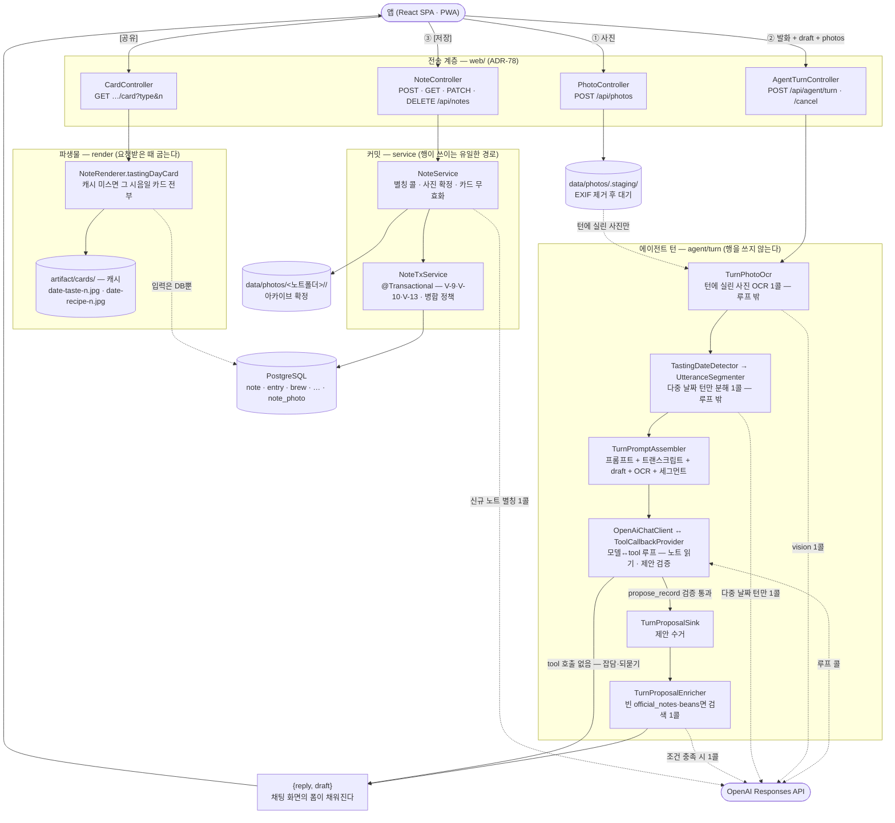
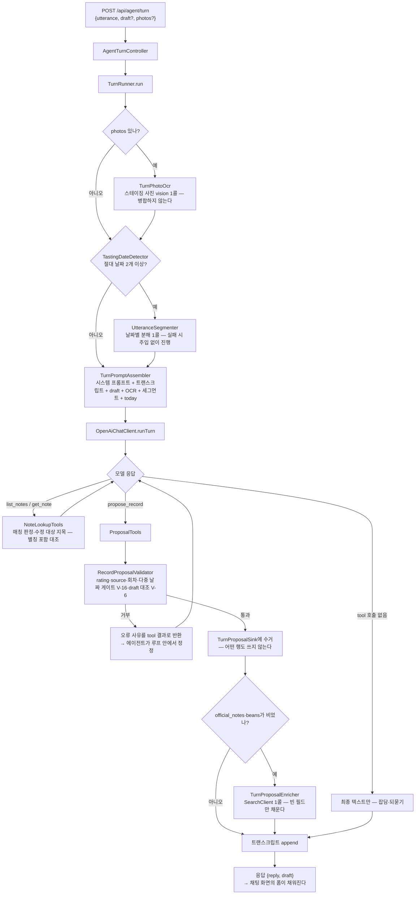
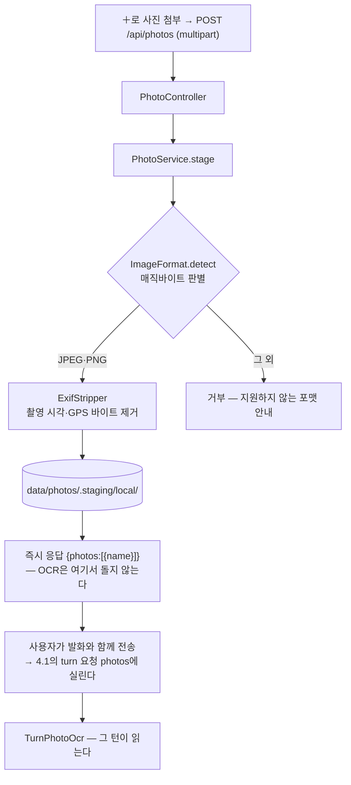
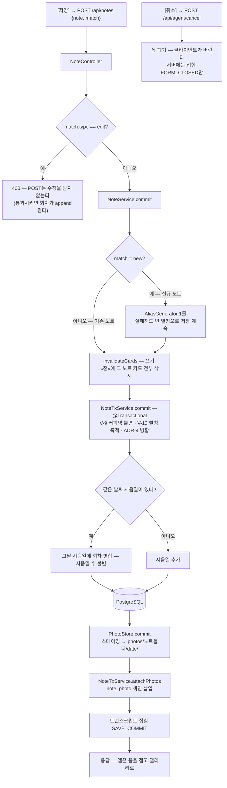
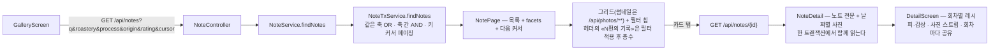
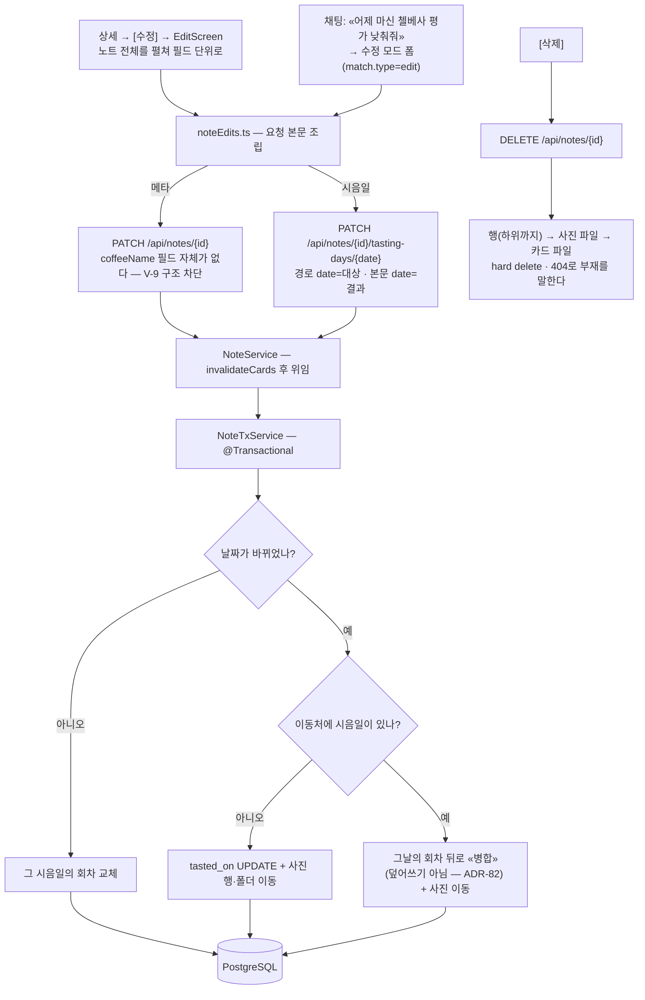
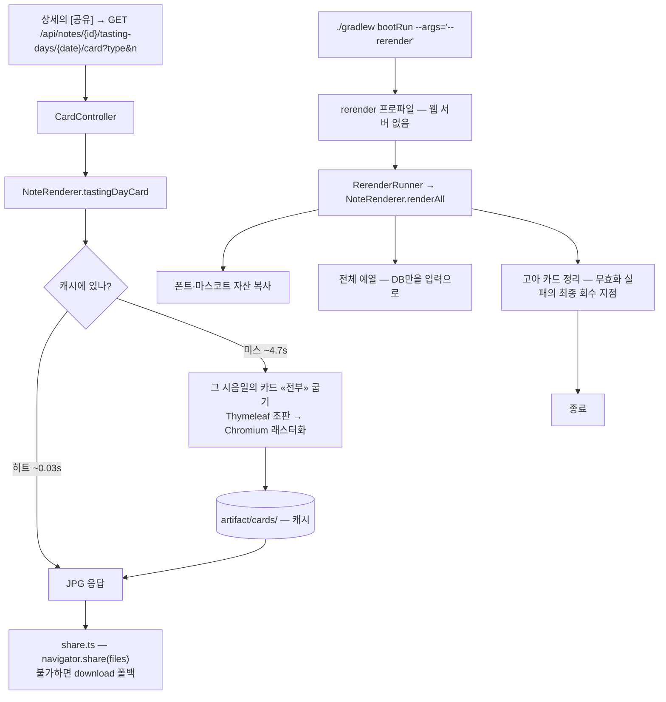
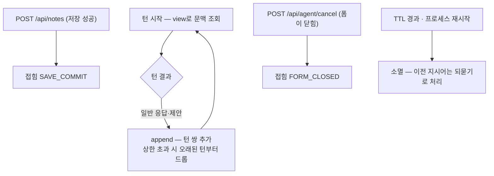
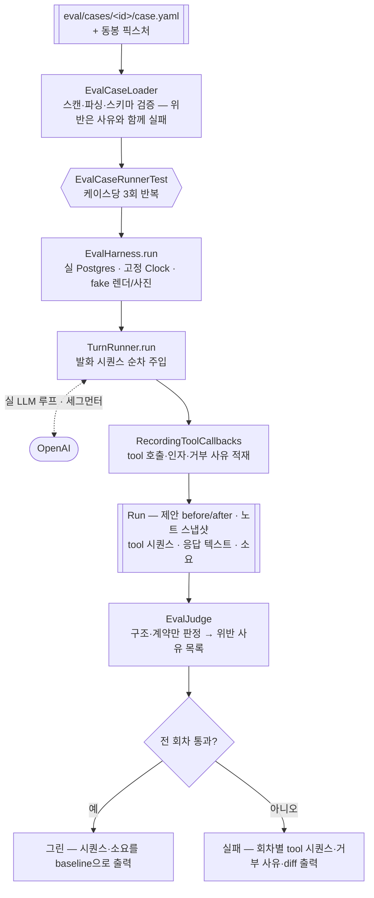

# 모카(Mocha) — 클래스 역할과 기능 흐름

> 이 문서는 백엔드(`src/main/java/com/devwuu/mocha/`, 클래스 133개)와 프론트엔드(`frontend/src/`, 모듈 18개)의 역할·기능별 처리 흐름, 그리고 그것을 검증하는 테스트 하네스를 정리한 참조 문서다.
> 소스와 spec(`specs/coffee-note-agent/`)을 기준으로 작성했으며, 도메인 특유 용어는 §1 용어 사전에 정의를 두었다. 본문에서 처음 나오는 용어는 **굵게** 표시한다.
> 에이전트 계층 공개 타입의 명명은 Spring AI 어휘에 대응한다(plan ADR-65) — 대응표는 §6이 소유한다.
> §1~§4는 실행 코드의 구조를, §5는 그 구조를 무엇으로 검증하는지(`src/test`)를 다룬다.
>
> **기준 시점: changes/0028(RDB 전환) · 0029(앱 인터페이스 전환) 반영 후.** 이전 판본은 *"Slack에 던진 감상을 JSON 파일로 기록한다"*를 전제로 쓰였고, 그 전제는 둘 다 만료됐다 — **저장 매체는 PostgreSQL**(ADR-73)이고 **입구는 앱(PWA)**이다(ADR-78·80). 결정의 정본은 언제나 `specs/`이고 이 문서는 코드를 읽기 위한 지도다.

---

## 목차

1. [용어 사전](#1-용어-사전)
2. [전체 아키텍처 개관](#2-전체-아키텍처-개관)
3. [패키지별 클래스 역할](#3-패키지별-클래스-역할)
4. [기능별 흐름 그래프](#4-기능별-흐름-그래프)
5. [테스트 하네스](#5-테스트-하네스--계약-관측-행동-회귀)
6. [모카 ↔ Spring AI 대응표](#6-모카--spring-ai-대응표-adr-65)

---

## 1. 용어 사전

모카는 "앱 채팅창에 자연어로 던진 커피 감상을 구조화해 DB에 기록하고, 갤러리·상세로 다시 보며, 공유할 때 카드 이미지로 굽는 1인용 에이전트"다. 아래 용어들은 코드 전반에 등장하며, 각 정의는 코드상 실제 의미 기준이다.

### 데이터 단위

| 용어 | 정의 |
|---|---|
| **노트(Note)** | **커피 1종**에 대한 기록 전체. `note` 테이블 1행 + 자식 행들에 대응한다. 커피명·로스터리·원두 구성(beans) 같은 "커피의 사실"과, 날짜별 시음 기록(시음일) 목록을 담는다. |
| **시음일(TastingDay)** | 노트에 딸린 **날짜별 시음 기록 1건**. "버전 = 날짜"가 원칙이라 하루 2시음일은 없다(`UNIQUE(note_id, tasted_on)`) — 같은 날짜에 다시 기록하면 그날 시음일의 회차(cups)로 병합된다. |
| **회차(Cup)** | 시음일 안의 **한 번 내려서 마신 단위** — `{ recipe, review }` 1쌍. 레시피와 그 결과물의 감상이 회차 안에서 1:1로 짝지어지며(참조 필드 없음 — 구조가 짝을 표현), **회차 번호는 `cup.seq` 컬럼이 소유한다**(구 JSON의 "배열 순서 = 회차 번호"라는 암묵 의존은 0028에서 사라졌다). |
| **id (대체키)** | 노트의 식별자 — DB가 발급하는 `BIGSERIAL`. **구 `slug`(파일명이자 식별자)는 파일 폐기와 함께 근거를 잃고 폐기됐다**(ADR-75). `Note.id == null`이 *"아직 저장되지 않음"*의 유일한 표현이고, 그 판정이 곧 신규/기존 분기다. |
| **원두 구성(beans)** | 노트의 `beans` — 원두 1종당 `{ description(원산지·품종 자유 텍스트), process(가공방식) }`. 블렌드는 구성 원두마다 요소를 만들어 원두별 가공방식을 담는다(ADR-53). |
| **official_notes(공식 노트)** | 로스터리가 상품 페이지·원두 봉투에 **전시한 테이스팅 노트**("자스민, 베르가못" 등). 사용자의 감상(`my_taste`)과 구분되는 "로스터리가 말하길" 영역이며, 로스터리 출처가 없으면 비워둔다(일반 출처 대체 금지). |
| **my_taste / my_taste_original** | 사용자가 실제로 느낀 감상 — 회차 review 안에 있다. `my_taste`는 한국어 음슴체로 정규화한 표시용 값("맛있더라"→"맛있었음"), `my_taste_original`은 말한 그대로의 원문. 항상 함께 저장되고 렌더는 정규화본만 쓴다. |
| **레시피(Recipe)** | 회차의 추출 정보 — 방식별 분기 없는 flat 10필드, 전 필드 nullable. **수치 6**(`dose_g`·`water_ml`·`yield_ml`·`time_sec`·`temp_c`·`grind`)이 그대로 카드의 6타일이고, **텍스트 4**는 `method`(뱃지 표시 전용)·`grinder`(분쇄도 타일의 서브라벨)·`detail`(상세 레시피)·`feedback`이다. `grind`가 **수치**인 것과 `grinder`가 갈라져 나온 것은 *"매버릭 2.0으로 갈았는데 210클릭"*을 한 문자열에 담던 규칙이 폐기됐기 때문이고(ADR-86), **구조화되지 않는 표현의 행선지는 `detail` 하나**다(구 `machine`·`pouring`은 그 자리로 흡수·폐기). 사용자 발화에서만 채우고(검색·사진 보강 금지) 언급 없는 항목은 비운다. 비율·시간 표기 같은 파생값은 저장하지 않고 렌더가 계산한다. |
| **평가(Rating)** | 4단계 범주형 단일 선택 — `완전 내스타일`/`맛있다`/`맛은 있는데 내스타일은 아님`/`맛이 없다`. 회차 review 안에 있다(감상마다 평가가 다를 수 있음). |
| **별칭(Aliases)** | 노트의 **내부 매칭 전용** 한국어 음차·이표기 목록(예: "Ethiopia Chelbesa" → "에티오피아 첼베사"). 화면 어디에도 표시하지 않는다. 신규 노트 첫 저장 시 LLM 1콜로 생성하고, 이후 같은 노트로 매칭된 기록의 관측 표기를 콜 없이 축적한다. |
| **출처(Source) / Sourced** | 필드 값이 어디서 왔는지 — `user`(사용자) / `photo`(사진 OCR) / `search`(검색 보강). `Sourced<T>`는 값+출처를 함께 담는 래퍼이고, DB에서는 `(value, source)` 두 컬럼으로 떨어진다. 우선순위는 `user > photo > search`. 폼에서 `(사진)`/`(검색)` 표기의 근거이자, **사용자가 폼에서 고치면 그 값의 출처가 `user`가 되어 이후 보강이 덮지 못한다**(V-6). |
| **사진 색인(`note_photo`)** | 아카이브 사진 1장을 노트에 잇는 행 — `(note_id, tasted_on, seq, path)`. **참조 축이 시음일 id가 아니라 날짜**인 이유는 시음일이 저장 때마다 통째로 교체되기 때문이다(ADR-79). **바이트가 정본이고 행은 색인이다.** |

### 확인 플로우(저장 전)

| 용어 | 정의 |
|---|---|
| **draft(작성 중인 폼 상태)** | 아직 저장되지 않은 노트 1건. **서버가 아니라 클라이언트가 소유한다**(ADR-80) — 매 턴 요청 본문의 `draft`로 올라가고, 에이전트의 제안이 응답의 `draft`로 내려와 폼을 채운다. *구 `pending`(서버 확인 대기 행)·단일 대기 게이트·`propose_edit`는 0029에서 함께 폐기됐다.* |
| **제안(proposal)** | 모델의 `propose_record` 호출이 서버 검증을 통과한 결과. **효과는 폼을 채우는 데까지**이고 어떤 행도 쓰지 않는다 — 수거함(`TurnProposalSink`)에 담겨 턴 응답에 실린다. |
| **매칭(match)** | 이번 폼이 무엇인지의 판정 — `new`(새 노트) / `existing`(기존 노트에 회차·시음일 추가) / **`edit`(기존 시음일을 고침)**. **`existing`과 `edit`은 같은 노트를 가리켜도 의도가 반대**라(추가 ↔ 교체) 합치지 않는다. 저장 경로가 여기서 갈린다 — `edit`이면 `PATCH`, 그 외는 `POST`. |
| **수정 모드 폼** | *"어제 마신 첼베사 평가 낮춰줘"* 류 발화가 만드는 폼(D-14). 자연어가 하는 일은 **대상 지목 + 초안 채우기**까지이고 확정은 폼 + [저장]이다. 노트 레벨 값은 잠기고(readOnly) 회차·날짜만 열린다. |
| **커밋(commit)** | `POST /api/notes`(신규·추가) 또는 `PATCH /api/notes/{id}`·`/tasting-days/{date}`(수정)로 실제 행이 쓰이는 것. **에이전트 턴은 읽기만 한다** — 쓰기는 사용자의 [저장]이 만드는 이 요청뿐이다(ADR-3 불변). |
| **접힘(fold)** | 트랜스크립트를 비우는 결정론 이벤트. 트리거는 둘 — `SAVE_COMMIT`(`POST /api/notes`)과 `FORM_CLOSED`(`POST /api/agent/cancel` — 취소든 저장 후 정리든 서버가 아는 사실은 *"이 작업은 끝났다"*뿐이라 라벨을 그 수준으로 낮췄다). TTL 소멸은 내부 판정이라 트리거가 아니다. |

### 에이전트 루프

| 용어 | 정의 |
|---|---|
| **에이전트 턴(agent turn)** | `POST /api/agent/turn` 1회의 처리 전체 — 전처리(사진 OCR·다중 날짜 분해) → 컨텍스트 조립 → LLM 호출 ↔ tool 실행 루프 → 제안 수거 → **검색 보강** → 트랜스크립트 축적. 산출은 `{reply, draft}`다. |
| **tool (function tool)** | 모델이 호출하는 실행 단위. **3종** — `list_notes`(노트 메타+별칭 목록)·`get_note`(노트 전체)·`propose_record`(기록 제안). 전부 function tool이고 **드라이버 내장 tool은 장착하지 않는다**(구 `web_search`는 ADR-84에서 뗐고, `propose_edit`·`send_entry_card`는 0029에서 소멸했다). |
| **검색 보강(enrich)** | `official_notes` 또는 `beans`가 빈 제안에 한해 **루프 밖에서 반드시 도는 결정론 단계**(ADR-84). 빈 필드만 채우므로 사용자·사진 값을 덮을 경로가 구조적으로 없다. *모델 재량 tool이던 시절 호출이 조용히 0회로 수렴한 실측이 이 결정의 근거다.* |
| **트랜스크립트(transcript)** | 에이전트 턴 **사이**의 대화 문맥(`FoldingChatMemory`). "그거"류 지시어, 되물음 왕복, 잡담→기록 전환을 해석하는 근거가 되는 (사용자 발화, 모카 응답) 쌍의 목록이다. 사용자당 1건, **메모리 전용**(재시작 시 소멸), TTL·턴 수 상한을 가진다. |
| **다중 날짜 게이트 / 세그먼트 분해** | 한 발화에 서로 다른 절대 시음 날짜가 2개 이상 섞였을 때의 이중 장치(ADR-60·61). 결정론 **날짜 탐지기**(정규식, 상대 날짜 제외)가 다중 날짜를 보고하면 **세그먼터**(LLM 1콜)가 원문을 날짜별로 분해해 컨텍스트에 주입하고, 에이전트는 가장 이른 날짜만 제안한다. 서버 검증의 게이트(V-16)가 뭉뚱그림 제안을 최종 방어한다. |
| **환각 필터** | 실존하지 않는 노트·시음일을 대상으로 제안이 진행되지 않게 막는 서버 검사. 미존재 대상은 오류 사유를 tool 결과로 돌려줘 에이전트가 루프 안에서 정정한다. |
| **strict schema** | 제안 tool 인자의 JSON 스키마 강제(전 필드 required, additionalProperties=false). 인자의 **형태**는 스키마가, **값 수준 규칙**(rating 4범주 등)은 서버 검증(`RecordProposalValidator`)이 담당한다. |
| **폴백(fallback)** | 에이전트 턴 실패 시(LLM 오류·턴 상한 3종 도달 — tool 호출 수·누적 토큰·경과 시간, ADR-62) 수렴하는 결정론 경로 — 어떤 행도 건드리지 않고 안내만 하며, 사용자 원문은 파일 로그에 남아 유실되지 않는다(ADR-69 ① 박제 회수 경로). |

### 사진 처리

| 용어 | 정의 |
|---|---|
| **업로드(`POST /api/photos`)** | multipart로 받은 사진을 **EXIF 제거 → 포맷 게이트 → 스테이징**까지 처리하고 파일명을 즉시 돌려준다. **여기서 OCR은 돌지 않는다**(D-11) — 읽기는 그 사진이 실린 턴이 한다. |
| **스테이징(staging)** | 노트 소속이 확정되기 전 사진을 `data/photos/.staging/<userId>/`에 임시 보관하는 것. 신규 노트는 `id`를 DB가 발급하므로 커밋 전에는 최종 경로를 알 수 없다. |
| **아카이브(archive)** | 저장 확정된 사진의 최종 위치 `data/photos/<노트폴더>/<date>/`. `<노트폴더>` = `<id>-<로스터리>-<커피명>`(생성 시점 스냅샷). 갤러리 썸네일·상세 화면이 `/api/photos/**`로 읽는다 — **사진을 렌더링하지 않는다는 구 ADR-32는 폐기됐다**(ADR-79). |
| **EXIF 제거** | 업로드 시 촬영 시각·GPS를 **바이트 레벨로** 걷어내는 것(`ExifStripper`). OCR에도 카드에도 EXIF는 쓰이지 않으므로 잃는 것이 없고, 쌓이면 생활 반경이 되는 정보를 남기지 않는다. |
| **스윕(sweep)** | 앱 시작 시 스테이징의 **고아** 파일을 청소하는 것(`StagingSweeper`). |
| **OCR / vision 추출** | 턴에 실린 사진에서 커피 정보(커피명·로스터리·원두 구성·로스팅·공식 노트)를 vision 모델로 읽어 구조화하는 것. 에이전트 tool이 아니라 **루프 전 결정론 전처리 1콜**이며, **병합하지 않는다** — 읽은 재료를 컨텍스트로 주입하면 발화·검색과 합치는 일은 모델이 한다. |
| **매직바이트 판별** | 사진 포맷을 확장자·MIME이 아닌 파일 선두 바이트로 판별하는 것. 수용 포맷(JPEG/PNG)만 스테이징을 통과한다. *HEIC 우회는 iOS 이미지 피커가 JPEG로 변환하며 근거가 사라졌다.* |

### 렌더링

| 용어 | 정의 |
|---|---|
| **회차 카드(cup card)** | 회차 파트 1건을 담은 4:5 비율(1080×1350) 공유용 JPG — 감상 카드(`<date>-review-<n>.jpg`, review 있는 회차만)와 레시피 카드(`<date>-recipe-<n>.jpg`, recipe 있는 회차만) 2종. Thymeleaf로 조판한 HTML을 헤드리스 Chromium으로 래스터화해 굽는다(카드 HTML은 파일로 남기지 않는 중간 입력). |
| **온디맨드 렌더 + 캐시 무효화** | 카드는 **저장 시점이 아니라 요청받은 때** 굽는다(ADR-81). `GET …/card`가 유일한 생성 경로이고 `artifact/cards/`는 산출 디렉터리가 아니라 **캐시**다. 그래서 **저장이 지는 카드 책임은 굽는 것이 아니라 지우는 것**이며, 무효화 축은 노트 하나·시점은 **쓰기 전**이다(폴더 접미가 지금 이름으로 계산되므로 나중에 지우면 옛 카드가 고아로 남는다). |
| **리렌더(rerender)** | DB만으로 카드 전체를 재생성하는 것. `--rerender` CLI가 웹 서버 없이 단독 실행하며, 성격은 *"완결된 산출"*이 아니라 **전체 예열 + 고아 정리**(무효화 실패의 최종 회수 지점)다. |
| **테마(Theme)** | 카드의 디자인 세트(type-a 세리프·명조 / type-b 귀여운·고딕+마스코트). 템플릿 폴더와 번들 폰트를 선택하며 데이터에는 영향이 없다. |

---

## 2. 전체 아키텍처 개관

**한 프로세스가 API와 화면을 함께 낸다**(ADR-78). 브라우저에서 도는 SPA가 `/api/**`를 호출하고, 그 밖의 경로는 `index.html`로 떨어져 클라이언트 라우터가 해석한다 — `/api` 아래는 fallback하지 않고 **404**다(매핑 부재가 JSON 파싱 오류 뒤에 숨지 않게).

**기록 1건의 일생**을 따라가면 구조가 그대로 드러난다. 쓰기는 두 단계로 격리돼 있다:

- **① 사진 업로드**(선택)는 EXIF를 걷고 스테이징에 서고,
- **② 에이전트 턴**은 그 사진과 발화를 읽어 **폼을 채우는 것까지만** 한다 — 어떤 행도 쓰지 않는다,
- **③ [저장]**(`POST`/`PATCH`)만이 행을 쓰고, 카드는 그 뒤 **공유를 요청받을 때** 구워진다.

OpenAI SDK 타입은 어댑터 구현 클래스 안에만 존재하고, 나머지 코드는 인터페이스 경계만 참조한다(NFR-4). 협력자 조립·전역 인스턴스(`Clock`·`ObjectMapper`) 생성은 `config/`가 소유한다(ADR-63). OpenAI 콜은 네 지점(점선)에서만 일어난다 — 루프·OCR·**검색 보강**·별칭에 더해, 다중 날짜 턴에만 세그먼터 1콜이 추가된다.

```mermaid
flowchart TB
    APP(["앱 (React SPA · PWA)"])
    OPENAI(["OpenAI Responses API"])

    subgraph WEB["전송 계층 — web/ (ADR-78)"]
        PHOTOC["PhotoController<br/>POST /api/photos"]
        TURNC["AgentTurnController<br/>POST /api/agent/turn · /cancel"]
        NOTEC["NoteController<br/>POST · GET · PATCH · DELETE /api/notes"]
        CARDC["CardController<br/>GET …/card?type&n"]
    end

    STAGING[("data/photos/.staging/<br/>EXIF 제거 후 대기")]

    subgraph TURN["에이전트 턴 — agent/turn (행을 쓰지 않는다)"]
        OCR["TurnPhotoOcr<br/>턴에 실린 사진 OCR 1콜 — 루프 밖"]
        SEG["TastingDateDetector → UtteranceSegmenter<br/>다중 날짜 턴만 분해 1콜 — 루프 밖"]
        ASM["TurnPromptAssembler<br/>프롬프트 + 트랜스크립트 + draft + OCR + 세그먼트"]
        LOOP["OpenAiChatClient ↔ ToolCallbackProvider<br/>모델↔tool 루프 — 노트 읽기 · 제안 검증"]
        SINK["TurnProposalSink<br/>제안 수거"]
        ENRICH["TurnProposalEnricher<br/>빈 official_notes·beans면 검색 1콜"]
    end

    FORM["{reply, draft}<br/>채팅 화면의 폼이 채워진다"]

    subgraph COMMITG["커밋 — service (행이 쓰이는 유일한 경로)"]
        SVC["NoteService<br/>별칭 콜 · 사진 확정 · 카드 무효화"]
        TX["NoteTxService<br/>@Transactional — V-9·V-10·V-13 · 병합 정책"]
    end

    DB[("PostgreSQL<br/>note · entry · brew · … · note_photo")]
    ARCHIVE[("data/photos/<노트폴더>/<date>/<br/>아카이브 확정")]

    subgraph REN["파생물 — render (요청받은 때 굽는다)"]
        RENDER["NoteRenderer.tastingDayCard<br/>캐시 미스면 그 시음일 카드 전부"]
        CARDS[("artifact/cards/ — 캐시<br/>date-taste-n.jpg · date-recipe-n.jpg")]
    end

    APP -->|"① 사진"| PHOTOC --> STAGING
    APP -->|"② 발화 + draft + photos"| TURNC --> OCR --> SEG --> ASM --> LOOP
    STAGING -.->|"턴에 실린 사진만"| OCR
    LOOP -->|"propose_record 검증 통과"| SINK --> ENRICH --> FORM
    LOOP -->|"tool 호출 없음 — 잡담·되묻기"| FORM
    FORM --> APP
    APP -->|"③ [저장]"| NOTEC --> SVC --> TX --> DB
    SVC --> ARCHIVE
    APP -->|"[공유]"| CARDC --> RENDER --> CARDS
    RENDER -.->|"입력은 DB뿐"| DB

    LOOP <-.->|"루프 콜"| OPENAI
    OCR -.->|"vision 1콜"| OPENAI
    SEG -.->|"다중 날짜 턴만 1콜"| OPENAI
    ENRICH -.->|"조건 충족 시 1콜"| OPENAI
    SVC -.->|"신규 노트 별칭 1콜"| OPENAI
```

그림에 없는 진입로는 하나뿐이다: `--rerender` CLI(§4.6)는 웹 서버를 띄우지 않고 DB → `artifact/` 전체 재생성 + 고아 정리만 수행한다.

핵심 불변식:

- **DB가 유일한 원본** — 카드 JPG는 언제든 재생성 가능한 파생물이고, 사진은 렌더 입력이 아닌 아카이브다(그 색인만 DB에 있다).
- **쓰기 경로는 두 단계로 격리** — 에이전트 턴은 읽기만, 커밋은 사용자의 [저장]이 만드는 REST 요청만.
- **서버는 확인 대기 상태를 갖지 않는다** — 작성 중 데이터가 서버 행으로 존재하면 ADR-80이 되돌려진 것이다.
- **트랜잭션 안에서 외부 호출 없음** — 규칙이 아니라 계층(`NoteService` → `NoteTxService`)으로 지켜진다.
- 트랜스크립트만 메모리 전용(재시작 시 소멸), 사진 바이트·행은 파일·DB로 생존.

### 2.1 대화 문맥 모델 — 무상태 API 위에서 연속성 만들기

에이전트 관련 클래스(`FoldingChatMemory`·`TurnPromptAssembler` 등)가 왜 이런 모양인지는 하나의 전제에서 전부 따라 나온다:

> **LLM API는 무상태(stateless)다.** 모델은 이번 요청에 실려 온 것만 보고 응답하며, 요청이 끝나면 서버는 그 대화를 기억하지 않는다. "모카가 이전 대화를 기억한다"는 감각은 전부 **클라이언트(모카)가 매 턴 이전 문맥을 다시 조립해 실어 보내서** 만들어진다.

이 전제 위에서 구성요소별 존재 이유:

1. **컨텍스트 = 이번 턴에 모델이 보는 것 전부.** 매 턴 `TurnPromptAssembler`가 처음부터 다시 조립한다 — 시스템 프롬프트(항구 정책) + 턴 컨텍스트(today·**현재 폼 상태 draft**·OCR·다중 날짜 세그먼트) + 트랜스크립트 + 이번 발화.

2. **트랜스크립트 = 턴 사이 연속성의 유일한 근거.** API가 기억하지 않으므로 "그거"류 지시어·되물음 왕복은 클라이언트가 이력을 보관했다가 재전송해야만 해석된다. 단, 전체 로그가 아니라 (사용자 발화, 모카 최종 응답) 쌍만 남기는 압축 저장이다.

3. **예외 — 한 턴 안의 tool 루프는 서버가 이어준다.** Responses API의 `previous_response_id`로, `OpenAiChatClient`는 이터레이션마다 이전 내용 전체를 재전송하는 대신 응답 id + function_call_output만 싣는다. 이 연속성의 수명은 턴 하나다.

4. **문맥은 무한히 커질 수 없으므로 접는다 — 단, 결정론적으로.** LLM 요약 압축(compaction) 대신 관측 가능한 이벤트만으로 푼다: [저장]·폼 닫힘 시 접힘, 턴 상한 초과 시 오래된 턴 드롭, TTL 경과 시 소멸. 접힘이 가능한 이유는 **구조화된 draft가 이후 문맥의 압축본 역할을 대신하기** 때문이다 — 그리고 0029에서 그 draft는 서버가 아니라 **클라이언트가 들고 매 턴 되싣는다.** 클래스명 `FoldingChatMemory`의 `Folding`이 이 차이다(ADR-65 ②).

재료별 보관 주체와 수명으로 정리하면:

| 컨텍스트 재료 | 보관 주체 | 수명 |
|---|---|---|
| 시스템 프롬프트 | `AgentSystemPrompt` (코드 상수) | 영구 |
| today·타임존 | `Clock` (config 공통 빈, 조립 시점 평가) | 턴 1회 |
| **draft(폼 상태)** | **클라이언트** — 매 턴 요청 본문으로 왕복 | 폼이 열려 있는 동안(새로고침 시 소멸) |
| OCR 결과 | 턴 내 전처리 산물 (미보관) | 턴 1회 |
| 다중 날짜 세그먼트 | 턴 내 전처리 산물 (미보관) | 턴 1회 |
| 대화 이력 | `FoldingChatMemory` (메모리) | 접힘·턴 상한·TTL·재시작 |
| 이번 발화 | 턴 요청 본문 | 턴 1회 |
| 턴 내 tool 루프 상태 | OpenAI 서버 (`previous_response_id`) | 턴 1회 |

---

## 3. 패키지별 클래스 역할

### 3.1 `web` — REST 표면 (12개)

> changes/0029에서 신설. **매체라서 있는 것만 소유한다** — 요청 파싱·응답 형태·실패 상태 코드까지이고, 정책은 아래 계층에 있다.

| 클래스 | 종류 | 역할 |
|---|---|---|
| `AgentTurnController` | @RestController | `POST /api/agent/turn` — `{utterance, draft?, photos?}`를 받아 턴을 돌리고 `{reply, draft}`를 돌려준다. 턴 실패는 500이 아니라 **안내 문구를 담은 정상 응답 + 빈 draft**로 수렴한다(ADR-48). `POST /api/agent/cancel`은 트랜스크립트 접힘(`FORM_CLOSED`) 통지 — 본문도 응답도 없다. |
| `NoteController` | @RestController | 노트 REST 표면 — 쓰기 넷·읽기 셋. `POST /api/notes`(폼 확정 저장 + `SAVE_COMMIT` 접힘) · `GET /api/notes/candidates`(매칭 후보) · `GET /api/notes`(갤러리 목록) · `GET /api/notes/{id}`(상세) · `PATCH /api/notes/{id}`(메타 수정) · `PATCH …/tasting-days/{date}`(시음일 교체·날짜 이동) · `DELETE /api/notes/{id}`. **`POST`는 `match.type: edit`을 거부한다**(400 — 통과시키면 «의도는 수정, 결과는 추가»가 된다). 실패 코드가 자리로 갈린다: `POST`의 대상 소실은 **409**(상태 충돌), `PATCH`·`DELETE`의 그것은 **404**(자원 부재). |
| `PhotoController` | @RestController | `POST /api/photos`(multipart) — EXIF 제거·포맷 게이트·스테이징까지 하고 파일명을 즉시 돌려준다. **여기서 OCR이 돌지 않는 것이 이 API의 정의다**(D-11). |
| `CardController` | @RestController | `GET /api/notes/{id}/tasting-days/{date}/card?type=review|recipe&n=` — 회차 카드 온디맨드. **카드의 유일한 생성·소비 경로**이고, 미스면 그 시음일의 카드 전부를 굽는다(브라우저 기동이 카드 장수보다 비싸다). `no-store`. |
| `DraftBody` | record | 클라이언트가 주고받는 **폼 상태 전체** — `TurnDraft`의 REST 판본. 같은 값이 세 방향으로 흐른다(폼→서버 / 제안→폼 / 저장 본문). |
| `NoteBody` | record | 작성 중인 노트 — 도메인 `Note`에서 `aliases`만 뺀 형태. 별칭은 내부 전용이라 폼이 표시도 편집도 하지 않는다. |
| `NoteDetailBody` | record | `GET /api/notes/{id}` 응답 — 저장된 노트 전문 + 날짜별 사진. `NoteBody`(작성 중)와 갈리는 것이 존재 이유다. |
| `NoteListBody` | record | `GET /api/notes` 응답 — 갤러리 한 페이지. 도메인 `NotePage`와 갈리는 지점은 둘뿐(사진이 URL, 커서가 불투명 문자열). |
| `NoteMetaBody` | record | `PATCH /api/notes/{id}` 요청. **`coffeeName` 필드가 없는 것이 이 타입의 존재 이유다** — 커피명 불변(V-9)을 구조로 차단한다. |
| `TastingDayBody` | record | `PATCH …/tasting-days/{date}` 요청. **경로의 `date`가 대상이고 본문의 `date`가 결과다** — 둘이 다르면 날짜 이동. |
| `NoteCursorCodec` | final class | 페이징 커서의 전송 표현(`NoteCursor` ↔ base64 불투명 문자열). 클라이언트가 만들지도 해석하지도 않아 정렬 축이 바뀌어도 따라 바뀌지 않는다. |
| `PhotoUrl` | final class | 아카이브 상대 경로 → ``에 그대로 꽂는 URL. **규칙의 소유자는 서버 하나** — 폴더 접미가 생성 시점 스냅샷이라 클라이언트가 재계산할 수 있는 값이 아니다. |

### 3.2 `agent` — 루프 드라이버 (3개)

| 클래스 | 종류 | 역할 |
|---|---|---|
| `ChatClient` | interface | 에이전트 루프 드라이버의 경계(Spring AI 원명 채택 — ADR-65 ①). "모델↔tool 루프를 상한까지 돌리고 최종 텍스트를 반환한다"는 계약만 정의 — 루프 밖 코드가 OpenAI SDK를 모르게 한다. |
| `OpenAiChatClient` | class | Responses API 기반 구현체. 모델 호출 → function call 수집 → tool 실행 → 결과를 다음 입력에 실어 재호출을 반복하고, tool 호출이 없는 응답이 오면 그 텍스트로 턴을 마친다. 턴 상한 3종(tool 호출 수·누적 토큰·경과 시간) 검사, 미등록 tool·실행 오류를 `{"error": 사유}`로 돌려주는 정정 루프, 누적 usage 로그를 담당한다. **드라이버 내장 tool은 장착하지 않는다**(ADR-84). |
| `AgentException` | exception | 턴 실패 신호(모델 오류·상한 도달). 호출부가 결정론 폴백으로 수렴시킨다. |

### 3.3 `agent.conversation` — 대화 문맥 (2개)

| 클래스 | 종류 | 역할 |
|---|---|---|
| `FoldingChatMemory` | class | 작업 트랜스크립트 보관소 — 사용자당 1건, 메모리 전용. 턴 추가(`append`, 상한 초과 시 오래된 턴 드롭), 조회(`view`, TTL 경과 시 소멸), 접힘(`clear`)을 제공한다. 중첩 enum `FoldTrigger`가 배선 지점을 정의한다 — `SAVE_COMMIT`(`POST /api/notes`)·`FORM_CLOSED`(`POST /api/agent/cancel`). |
| `TranscriptTurn` | record | 트랜스크립트의 턴 1건 = (사용자 발화, 모카 응답) 쌍. 턴 수 상한의 계수 단위. |

### 3.4 `agent.prompt` — 턴 입력 조립 (3개)

| 클래스 | 종류 | 역할 |
|---|---|---|
| `AgentSystemPrompt` | final class | 시스템 프롬프트의 단일 소유 지점 — 모카 페르소나(다정한 반말, **`~멍` 어미 규칙은 D-15에서 폐기**, 마크다운 강조 금지), 대화 경계, 언어 정책, 출처 우선순위, **수정 흐름 지시**(대상 지목 → `match.type: edit`), **"너는 웹을 검색하지 않는다 · `search`는 서버가 붙이는 출처 · 다만 draft에 실려 온 `search` 값은 출처째 되실어라"**(ADR-84)를 텍스트로 인코딩. |
| `TurnPromptAssembler` | class | 턴 컨텍스트 조립기 — 시스템 프롬프트에 today·**draft**·OCR 결과·다중 날짜 세그먼트를 덧붙이고, 대화 이력을 메시지 목록으로 재구성해 `TurnPrompt`를 만든다. |
| `TurnPrompt` | record | 턴 1회의 입력(instructions + 메시지 목록). SDK 무관 경계 타입. 메시지 1건은 중첩 record `Message`(Role: USER/MOCHA). |

### 3.5 `agent.turn` — 턴 하네스 (8개)

> 턴 실행부와 전처리·후처리가 사는 곳. **0029 TΔ6a에서 `TurnRunner`가 여기로 내려왔다** — 구 `AgentConversationRouter`(Slack)가 지고 있던 오케스트레이션이 매체와 분리된 자리다.

| 클래스 | 종류 | 역할 |
|---|---|---|
| `TurnRunner` | class | **턴 실행부** — 사진 OCR → 다중 날짜 분해 → 컨텍스트 조립 → 루프 → 제안 수거 → **검색 보강** → 트랜스크립트 축적을 한 메서드로 소유한다. 턴 진입 관측 로그에 사용자 원문을 싣는 지점이기도 하다(ADR-69 ① — 성공 턴 포함, 개인 데이터라 `logs/` 비커밋). |
| `TurnPhotoOcr` | class | 이번 턴에 실린 스테이징 사진을 vision 1콜로 읽는다. **병합하지 않는다** — 내놓는 것은 *사진에서 읽은 재료*이고, 발화·검색과 합치는 일은 모델이 루프 안에서 한다. |
| `TurnProposalSink` | final class | 턴 1회의 **제안 수거함**. 종전에 제안의 효과는 *서버 pending 행 + Slack 미리보기 전송*이었는데, 그것이 사라지며 "검증을 통과한 내용을 호출부가 턴 종료 후 꺼내 간다"로 바뀐 자리다. |
| `TurnProposalEnricher` | class | **검색 보강 단계**(ADR-84) — 수거된 제안에서 `official_notes`·`beans`가 비어 있으면 `SearchClient` 1콜로 **빈 필드만** 채운다. 커피명이 없으면 발동하지 않고(동일성 가드의 앵커 부재), 실패·무결과는 draft 그대로 통과한다. |
| `TurnDraft` | record | 턴 입력의 **draft** — 사용자가 보고 고칠 수 있었던 현재 폼 상태를 검증기까지 나르는 SDK 무관 홀더. 이것이 있어 V-6(사용자 값을 보강이 덮지 않는다)이 비로소 실동작한다. |
| `TurnResult` | record | 턴 1회의 결과(최종 텍스트 + 제안). `POST /api/agent/turn` 응답 본문의 형태가 이것이다. |
| `TastingDateDetector` | final class | 결정론 시음 날짜 탐지기 — 원문에서 **절대 날짜 표기만** 정규식으로 세어 정렬 집합을 돌려준다. 상대 날짜("어제")는 오탐 방지를 위해 세지 않는다. 게이트(V-16)와 자동 분해 트리거가 공유하는 순수 유틸. |
| `TurnUserMessage` | record | 턴의 사용자 원문(+날짜별 세그먼트)을 제안 검증기까지 나르는 홀더 — 다중 날짜 게이트의 판정 입력. |

### 3.6 `agent.tool` — function tool 정의·실행 (12개)

| 클래스 | 종류 | 역할 |
|---|---|---|
| `ToolCallback` | record | tool 1종의 정의+실행기(이름·설명·인자 스키마·`Executor`). Spring AI 원명 채택(ADR-65 ①). |
| `ToolCallbackProvider` | class | **tool 3종의 façade** — 읽기 tool(`NoteLookupTools`)과 쓰기 제안 tool(`ProposalTools`)을 조립하고, 턴마다 userId·`TurnUserMessage`·`TurnDraft`·수거함을 바인딩한 tool 목록을 공급한다(`forTurn`). *0029 TΔ1에서 5종 → 3종으로 줄었다.* |
| `NoteLookupTools` | class | **읽기 tool 2종**: `list_notes`(전체 노트 메타+별칭)·`get_note`(노트 전체, 미존재 id는 오류 = 환각 필터). 둘 다 **매칭(FR-14)과 수정 대상 지목(FR-21)의 재료**이고, 산출이 사용자 눈으로 직접 가는 경로는 없다(그 자리는 갤러리·상세다). |
| `ProposalTools` | class | **쓰기 제안 tool 1종**: `propose_record`. 인자 파싱 → 서버 검증 → **수거함에 담기**까지가 효과의 전부다(커밋은 REST 요청만). strict schema 문자열도 여기서 정의한다. |
| `ToolSupport` | final class | tool 공용 유틸 — 모델 대면 오류 결과 형태(`{"error": 사유}`)의 **단일 정의 지점**(tool 구현 2종 + 루프 드라이버가 공유, ADR-67 ②)과 노트 리졸브. |
| `GetNoteArgs` | record | 읽기 tool 인자 값객체. |
| `ProposeRecordArgs` | record | 제안 tool 인자의 미검증 원시형 — strict schema 계약을 그대로 담는다. |
| `SourcedArg<T>` | record | 출처 표시 필드의 미검증 원시형(source가 String) — 검증 후 도메인 `Sourced`(enum)로 승격. enum 위반을 역직렬화 예외가 아니라 **사유 있는 거부**로 다루기 위한 계약 타입. |
| `BeanArg` / `CupArg` | record | beans·cups 인자의 미검증 원시형. `CupArg.recipe`는 전 필드 nullable이라 도메인 `Recipe`를 재사용하고, 감상만 중첩 record `ReviewArg`(rating이 String)로 따로 받는다. |
| `NoteSummary` | record | `list_notes` 응답 항목(id·커피명·로스터리·별칭·원두 요약·공식 노트·최근 시음일). |
| `RecordProposal` | record | 검증 통과 후 정규화된 도메인 제안 — 수거함에 담겨 응답 draft가 된다. |

### 3.7 `agent.tool.validation` — 제안 서버 검증 (6개)

> 위반은 예외가 아니라 **사유 있는 거부**로 수렴해 에이전트가 루프 안에서 정정한다. **0029 TΔ1 이후 진입점이 하나뿐**이라 백로그 R-3(try/catch 중복)·R-4가 함께 해소됐다.

| 클래스 | 종류 | 역할 |
|---|---|---|
| `RecordProposalValidator` | class | **유일한 검증 진입점** — 공유 패밀리 위임 + 고유 검증(필수 날짜, 다중 날짜 게이트 V-16, **draft 대조 V-6**, `match.type: edit`의 대상·날짜 필수 검사). |
| `SourceRules` | final class | 출처 규칙 패밀리(V-5·V-14) — 출처 인자를 도메인 `Sourced`로 정규화, 커피명은 user/photo만. |
| `CupRules` | final class | 회차 규칙 패밀리(V-1·V-8·V-15) — cups 인자를 도메인 `Cup` 배열로 정규화(rating 4범주·레시피 정규화·빈 회차 드롭). |
| `ValidationSupport` | final class | 규칙 패밀리 공용 조각 — 빈 값 위생·날짜 파싱 헬퍼. |
| `ToolValidation<T>` | sealed interface | 검증 결과 타입 — `Ok(값)` 또는 `Rejected(사유)`. |
| `RejectedException` | exception | 사유를 담아 `Rejected`로 수렴하는 패키지 내부 신호. |

### 3.8 `llm` — 루프 밖 보조 LLM 콜 (14개)

| 클래스 | 종류 | 역할 |
|---|---|---|
| `SearchClient` | interface | **웹 검색 보강 경계** — `search(query): SearchResult`. *0018에서 "내장 web_search가 흡수했다"며 지워졌다가 **0029 ADR-84에서 부활**했다(NFR-4의 검색 축).* |
| `OpenAiSearchClient` | class | 구현체 — Responses API의 web search. 검색 지침에 보강 정책을 인코딩한다: `official_notes`는 **로스터리 공식 출처 한정**, `beans`·`roast_level`은 공식 우선·없으면 신뢰할 만한 일반 출처, 동일성 가드, 한국어 기록. |
| `SearchQuery` / `SearchResult` | record | 보강 요청·결과 값객체. 결과는 아직 출처 마킹·병합 전이고, 무엇을 반영할지는 `TurnProposalEnricher`가 정한다(빈 필드만 = V-6 자동 충족). |
| `VisionClient` | interface | 이미지 → 커피 정보 구조화(OCR)의 경계. |
| `OpenAiVisionClient` | class | 구현체 — vision 모델에 이미지(`detail=high`)와 strict schema를 보내 커피 정보를 받는다. 추측 금지(미확인 null), 모든 실패는 빈 결과로 수렴. |
| `PhotoInfoExtractor` | class | OCR 전처리 오케스트레이터 — 스테이징 사진들을 **1회 호출**로 읽는다. 장수 상한 초과분은 제외하고, 로컬 바이트를 `data:` URI로 인코딩해 넘긴다(사진이 외부에서 접근 가능한 URL을 갖지 않는다). |
| `AliasGenerator` | interface | 별칭 생성 경계 — 노트당 평생 1회(신규 첫 저장). 실패해도 빈 별칭으로 수렴(저장은 유지). |
| `OpenAiAliasGenerator` | class | 구현체 — 최경량 텍스트 모델에 structured output으로 별칭 배열을 받는다. |
| `UtteranceSegmenter` | interface | 다중 날짜 발화 분리 경계 — 탐지기가 절대 날짜 2개 이상을 찾은 턴에만 루프 전 1콜. 분리만 한다(요약·번역·필드 추출 금지). |
| `OpenAiUtteranceSegmenter` | class | 구현체 — structured output, 전용 경량 모델 키. |
| `VisionExtraction` / `VisionHint` | record | OCR 결과·문맥 힌트 값객체. `empty()`가 실패·무정보의 표준 수렴값. |
| `OpenAiResponseTexts` | final class (패키지-프라이빗) | Responses 응답에서 텍스트를 뽑는 `outputText`의 단일 정의 — 어댑터들이 갖고 있던 동일 구현을 합친 것(ADR-67 ④). |

### 3.9 `service` — 유스케이스 계층 (5개)

> **분할 축은 트랜잭션이다**(ADR-77). *"이 로직이 한 트랜잭션 안에 있어야 하는가"*에 예/아니오로 답이 나오는 것이 이 축의 값이고, 그래서 *"트랜잭션 안에서 외부 호출 금지"*가 규칙 문장이 아니라 계층으로 지켜진다.

| 클래스 | 종류 | 역할 |
|---|---|---|
| `NoteService` | class | **외부 IO가 필요한 유스케이스의 오케스트레이션** — 상위 계층(컨트롤러·tool·렌더러)이 잡는 유일한 타입. 커밋 시 ① 신규면 별칭 LLM 1콜 → ② `NoteTxService.commit` → ③ 스테이징 사진을 아카이브로 이동 + 색인 삽입 → ④ **카드 캐시 무효화**(쓰기 «전»에). 삭제는 행·사진 파일·카드 파일을 모두 지운다. `@Transactional`이 **없다**. |
| `NoteTxService` | class | **한 트랜잭션 안이어야 하는 것** — `@Transactional` 경계. V-9(커피명 불변)·V-10(날짜 유일)·V-13(별칭 축적)·ADR-4 병합 정책·대상 소실 검사·행 순서 조율을 소유한다. *구 `JpaNoteRepository`가 이 자리였고 `@Transactional`도 거기 있었다 — 이미 TxService인데 이름만 저장소였다.* **날짜 이동 충돌은 덮어쓰기가 아니라 회차 병합**이다(ADR-82). |
| `PhotoService` | class | 사진 업로드 유스케이스 — **포맷 게이트 → EXIF 제거 → 스테이징**. OCR은 여기서 돌지 않는다. |
| `PhotoUpload` | record | 업로드된 사진 1장(아직 검증도 스테이징도 되지 않은 원본) — `MultipartFile`을 service까지 들이지 않기 위한 값객체. |
| `StagingSweeper` | class | 앱 시작 시 스테이징 고아 파일 청소(`ApplicationRunner`, `!rerender` 프로파일). |

### 3.10 `repository` — 영속 (5 + entity 13 + jpa 4)

> **저장소 3분할**(ADR-73 → ADR-77로 이름 재정의): `NoteTxService`(트랜잭션 단위 로직) → `NoteEntityRepository`(행 입출력) → 그리고 층이 아닌 **순수 함수** `NoteEntityMapper`(변환·조립). 엔티티에 **연관 매핑을 두지 않고**(`@OneToMany`·`cascade` 미사용) DB에 **FK도 없다**(ADR-75) — 관계를 아는 곳을 질의 한 곳으로 모은 결과다.

| 클래스 | 종류 | 역할 |
|---|---|---|
| `NoteEntityRepository` | interface | 노트 애그리거트의 행 입출력. Spring Data의 **custom fragment** 패턴 — 파생·기본 CRUD는 `JpaRepository`가, 자식 10종은 QueryDSL 구현이 맡고 `extends`로 이어져 바깥에는 인터페이스 하나로 보인다. |
| `NoteEntityRepositoryCustom` / `…CustomImpl` | interface / class | QueryDSL 몫 — 자식 행 조회·삽입·순서 삭제·목록 필터·후보 검색·페이징. Spring Data가 이름 규약(`<계약>Impl`)으로 붙인다. |
| `NoteChildRows` | record | 자식 행 묶음 — **정렬된 평면 목록**이지 조립된 그래프가 아니다. 그룹핑·3단 중첩 재구성은 매퍼가 한다. |
| `NoteEntityMapper` | final class | 도메인 record ↔ 엔티티 양방향 변환 + 3단 중첩 조립 + **로드 경계 위생**(ADR-66). 순수 함수라 트랜잭션과 무관하고, 그래서 층이 아니다. |
| `NoteFolderName` | final class | 노트 폴더 접미 생성기 `<id>-<로스터리>-<커피명>` — 새니타이즈·NFC 정규화·40자 제한. **사진이 이미 있는 노트는 계산하지 않고 `note_photo.path`에서 되읽는다**(폴더명은 생성 시점 스냅샷이라). |
| `PhotoStore` / `LocalPhotoStore` | interface / class | 사진 파일 저장소 경계와 구현 — 스테이징(`stage`/`readStaged`/`discard`), 아카이브 확정(`commit`), 날짜 이동(`moveTastingDayPhotos`), 고아 청소용 목록. 매직바이트 필터로 `.DS_Store` 같은 잔재가 OCR·아카이브에 새지 않게 한다. |
| `StagedImage` | record | 스테이징 사진 1장(파일명+바이트) — OCR의 입력 단위. |
| `entity/*` (13) | @Entity 등 | 테이블 매핑 — `NoteEntity`·`TastingDayEntity`·`CupEntity`·`RecipeEntity`·`ReviewEntity`·`NoteBeanEntity`·`NoteAliasEntity`(+`AliasKind`)·`NoteOfficialNoteEntity`·`NoteSourceEntity`·**`NotePhotoEntity`**·`SourcedValue`(@Embeddable — (value, source) 두 컬럼)·`BaseEntity`(감사 컬럼 4종). 도메인 record를 엔티티로 만들지 않는다 — 영속 관심사가 도메인으로 새지 않게 별도 클래스다. **`_by`는 «변경 주체»가 아니라 이 행을 쓴 사용자다**(ADR-83). |

### 3.11 `render` — DB → 회차 카드 (12개)

| 클래스 | 종류 | 역할 |
|---|---|---|
| `NoteRenderer` | interface | 렌더 경계 — `tastingDayCard`(**온디맨드 조회 + 미스 시 굽기**), `renderTastingDayCard`(그 시음일 카드 전부), `renderAll`(전체 예열 + 고아 정리). **지우는 일은 여기 없다** — 무효화는 `NoteService`가 한다(쓰기를 아는 곳이 거기 하나이고 반대 주입은 순환). |
| `ThymeleafNoteRenderer` | class | 주 구현체 — DB에서 노트를 읽어 회차마다 감상·레시피 카드 HTML을 조판해 JPG로 굽고 고아 카드를 정리한다. 폰트·마스코트 자산 복사도 담당. |
| `CardImageRenderer` / `PlaywrightCardImageRenderer` | interface / class | "카드 HTML → JPG 래스터화" 경계와 구현. 헤드리스 Chromium 뷰포트 스크린샷(순수 Java로는 flexbox·이모지·웹폰트 렌더가 불가능). 오프라인 컨텍스트로 CDN 미의존을 강제하고 autofit 완료 마커를 기다린 뒤 촬영한다. |
| `CardFiles` | final class | 카드 경로 규약(`cards/<노트폴더>/<date>-review-<n>.jpg`·`-recipe-<n>.jpg`)의 단일 소유 — 렌더러(산출·정리)와 온디맨드 조회가 공유한다. |
| `CardType` | enum | 카드 종류(감상·레시피). 사는 이유는 **온디맨드 API의 대상 지정**뿐이다 — 사용자가 고르는 축이 아니라 렌더 단위다. |
| `NoteView` | final class | 템플릿용 뷰 모델 — 중첩 record `TasteCard`·`RecipeCard`. 카드 단위 = 회차 파트 1건. |
| `KoreanDates` / `RatingStyle` | final class | 템플릿 헬퍼 — 한국어 날짜 포맷, 평가 4범주 배지 스타일. |
| `RecipeAmounts` | final class | 템플릿 헬퍼이자 **시간·수치 표기의 단일 소스**(15.0→"15", 비율 1:N, "N분 N초"). 표기 불가 수치는 `null`을 돌려줘 그 행을 생략하게 한다. *두 번째 소비자였던 Slack 미리보기는 0029에서 폐기됐고 지금 읽는 곳은 카드 템플릿 하나다.* |
| `Theme` | enum | 렌더 테마(type-a 세리프 / type-b 귀여운) — 템플릿 폴더·번들 폰트 선택. |
| `RerenderRunner` | class | `--rerender` CLI 진입점 — 전체 리렌더 후 종료. 이 프로파일에서는 **웹 서버가 뜨지 않아** 상주 인스턴스와 포트가 충돌하지 않는다. |

### 3.12 `domain` — 도메인 모델 (20개)

| 클래스 | 종류 | 역할 |
|---|---|---|
| `Note` | record | 커피 1종의 애그리게이트 — `id`(신규는 null), 커피명·로스터리·로스팅(출처 표시), `beans`, 공식 노트, 별칭, 참조 링크, 시음일 목록, 타임스탬프. 로드 경계 위생 `normalized()`의 단일 지점(ADR-66). |
| `Bean` · `TastingDay` · `Cup` · `Review` · `Recipe` | record | 원두 1종 / 날짜별 기록 / 회차 / 감상 / 레시피. 각자 정규화(V-14·V-15·V-8) 내장. |
| `Sourced<T>` · `Source` · `Rating` | record / enum | 값+출처 래퍼, 출처 3종, 평가 4범주. |
| `Aliases` | record | 별칭 목록 + 축적 로직(관측 표기 병합, 정규화 기준 중복 제거 — 저장값은 첫 등장 표기 보존). |
| `NoteMeta` | record | Note에서 id/tasting_days/타임스탬프를 뺀 "커피의 사실" 묶음 — 커밋·메타 수정의 입력. |
| `MatchInfo` | record | 매칭 판정 — `new` / `existing` / **`edit`**(대상 `note_id` + 필수 `date`). 폼의 모드와 저장 경로가 여기서 갈린다. |
| `NotePhoto` | record | 노트에 딸린 사진 1장 — 아카이브 파일의 색인. **사진은 노트가 아니라 날짜에 붙는다.** |
| `NoteCandidate` | record | 매칭 후보 1건 — 변경 시트의 한 줄. 노트를 *고르는* 자리라 3단 중첩을 쓰지 않는 납작한 사영. |
| `NoteListItem` · `NotePage` · `NoteCursor` · `NoteFacets` · `NoteFilter` | record | 갤러리 목록 축 — 그리드 한 칸 / 한 페이지 / **키 기반 커서**(offset이 아닌 이유: 스크롤 중 저장이 같은 노트를 두 번 보이게 한다) / 필터 칩 선택지(저장된 값에서 나온다) / 좁히기 조건(**같은 축 안은 OR, 축 간은 AND**). |
| `NoteDetail` | record | 상세 화면이 읽는 노트 전문 + 그 노트의 사진 전부. **같은 트랜잭션에서 읽어야** 해서 한 값으로 묶인다. |

### 3.13 `config` · `image` · `json` · 루트 (14개)

| 클래스 | 종류 | 역할 |
|---|---|---|
| `CommonConfig` | @Configuration | 전역 공통 빈 — `Clock`(Asia/Seoul)·`ObjectMapper` 각 1빈. 프로덕션에서 이 둘의 직접 생성은 여기뿐이다(ADR-63). |
| `TurnConfig` | @Configuration | 에이전트 턴 협력자 배선 — 검증기·`TurnPromptAssembler`·`ToolCallbackProvider`·`TurnPhotoOcr`·`TurnProposalEnricher`·`TurnRunner`. "누가 무엇으로 조립되는가"가 여기서 읽힌다. |
| `AgentConfig` | @Configuration | 루프 드라이버(`mocha.agent.model`·상한 3종)와 트랜스크립트(턴 상한·TTL), 세그먼터 빈. |
| `LlmConfig` | @Configuration | 루프 밖 보조 콜 어댑터(vision·별칭·**검색**) + OCR 전처리 빈. 역할별 모델 키 분리와 OCR 장수 상한을 소유. |
| `ServiceConfig` | @Configuration | 유스케이스 계층 배선 — **두 빈의 관계가 곧 계층 축이다**(`NoteTxService` = 트랜잭션 단위 / `NoteService` = 외부 IO 오케스트레이션). |
| `RepositoryConfig` | @Configuration | **파일 매체** 저장소 배선(`mocha.data.dir` — 사진). 노트는 DB에 있고 배선은 `ServiceConfig`가 소유한다. |
| `RenderConfig` | @Configuration | Thymeleaf 오프라인 템플릿 엔진 + 렌더러 배선(`mocha.artifact.dir`·테마). |
| `JpaAuditingConfig` | @Configuration | 감사 컬럼 주입 — `AuditorAware`는 **상수 한 줄**이다(`SingleUser.ID`). *구 `AuditActor`·ThreadLocal 컨텍스트는 ADR-83과 함께 삭제됐다.* |
| `WebConfig` | @Configuration | **SPA 정적 서빙 + 클라이언트 라우팅 fallback + 사진 아카이브 서빙**(`/api/photos/**`). 부트 기본 매핑을 끄고(`add-mappings=false`) 매핑을 단독 소유한다 — 같은 `/**` 패턴이 둘 등록되면 승자가 등록 순서에 달린다. |
| `ExifStripper` | final class | 업로드 사진의 메타데이터를 **바이트 레벨로** 걷어낸다(JPEG APP1·PNG eXIf/tEXt). 걷어낼 수 없는 형태면 거부한다. |
| `ImageFormat` | enum | 매직바이트 포맷 판별 — 확장자·MIME을 신뢰하지 않는다. |
| `MochaObjectMapper` | final class | JSON 직렬화 규칙의 단일 출처(snake_case 등). **노트는 이 매퍼를 지나지 않는다** — 매체가 DB로 옮겨졌고, 지금 소비자는 tool 인자 파싱·계약 테스트다. |
| `SingleUser` | final class | 고정 단일 사용자 식별자(`local`). 트랜스크립트 키·스테이징 디렉터리·감사 `_by`가 이 한 값을 쓴다 — **A3에서 인증 주체가 대체할 자리가 여기 하나**다. |
| `MochaApplication` | class | Spring Boot 진입점. `--rerender` 인자면 rerender 프로파일(웹 서버 없이 리렌더 후 종료), 아니면 상주 모드. |

### 3.14 `frontend/src` — 앱 화면 (18개)

> React + TypeScript + Vite. **작성 중인 상태는 전부 클라이언트가 소유한다**(ADR-80) — 새로고침하면 폼과 대화가 사라지는 것이 그 대가이고, 수용된 결정이다.

| 모듈 | 역할 |
|---|---|
| `main.tsx` · `App.tsx` · `routes.ts` | 진입점 + 라우팅. **라우터 라이브러리를 들이지 않는다**(right-sizing) — 경로로 화면을 고르고 뒤로 가기를 살리는 20줄. |
| `api/contract.ts` | 서버와 공유하는 REST 계약의 TS 판본. **정본은 `src/test/resources/contract/`의 JSON**이고, 자바 쪽 계약 테스트가 그것을 지킨다. |
| `api/http.ts` · `api/index.ts` | 실제 서버 호출부와 화면이 잡는 표면. 턴·저장·취소·후보·사진·목록·상세·수정·삭제·카드가 전부 실물이다(mock 없음). |
| `chat/ChatScreen.tsx` | **캡처 화면** — 발화 → 응답 → 폼 → [저장]/[취소]. 사진 첨부는 전송 전 스트립·전송 후 말풍선으로 보이고, 입력창은 줄바꿈을 지원한다(IME 가드 포함). |
| `chat/DraftForm.tsx` | **작성 폼** — 대화 흐름 안에 카드로 앉는다. 출처 배지(`(사진)`/`(검색)`), 수정 모드의 잠금(`readOnly` — 값이 읽히고 복사되어야 하므로 `disabled`가 아니다), 수정 모드에서만 열리는 날짜 입력. |
| `chat/MatchBadge.tsx` | **매칭 배지 + 변경 시트** — 에이전트의 판정을 사용자가 뒤집는 자리(배지 전체가 탭 영역). 후보 고르기는 2걸음(노트 → 시음일). |
| `chat/draftEdits.ts` | 폼 편집 = `Draft`의 불변 갱신. 값 변환 규칙 자체는 `formValues.ts`가 소유한다. |
| `formValues.ts` | **여기 사는 유일한 규칙**: 폼에서 고친 출처 표시 필드는 출처가 `user`가 된다. 캡처 폼과 수정 폼이 **같은 규칙**을 써야 하므로 어느 한 화면에 두지 않는다. |
| `gallery/GalleryScreen.tsx` · `FilterBar.tsx` · `noteQuery.ts` | **갤러리** — 사진 썸네일 그리드 + 검색창 + 필터 4축(로스터리·가공방식·원산지·평가) + 무한 스크롤. 사진이 없는 칸은 시안의 사선 패턴이 배경이 된다. |
| `detail/DetailScreen.tsx` · `share.ts` | **상세** — 노트 전문 + 회차별 레시피·감상 + 그날의 사진. **여기서 나가는 유일한 산출은 카드**이고, 공유는 `navigator.canShare({files})` 성공 시 공유 시트·아니면 다운로드 폴백이다. |
| `edit/EditScreen.tsx` · `noteEdits.ts` | **수정·삭제 화면** — 저장된 노트를 필드 단위로 고친다. *델타의 결론이 이 화면이다*: 로스터리를 고치는 데 필요한 것이 입력 필드 하나뿐이고, 자연어 인코딩도 동일성 판정도 없다. 저장은 메타·시음일 두 요청으로 갈린다. |

---

## 4. 기능별 흐름 그래프

### 4.1 캡처: 발화 → 폼 (FR-1·2·3·14·22)

"커피베라 예가체프 마셨는데 새콤하고 좋았다" 한 줄이 작성 폼에 도달하기까지.

```mermaid
flowchart TB
    A["POST /api/agent/turn<br/>{utterance, draft?, photos?}"] --> B[AgentTurnController]
    B --> C[TurnRunner.run]
    C --> D{photos 있나?}
    D -->|예| E[TurnPhotoOcr<br/>스테이징 사진 vision 1콜 — 병합하지 않는다]
    D -->|아니오| S
    E --> S{TastingDateDetector<br/>절대 날짜 2개 이상?}
    S -->|예| S2[UtteranceSegmenter<br/>날짜별 분해 1콜 — 실패 시 주입 없이 진행]
    S -->|아니오| G
    S2 --> G[TurnPromptAssembler<br/>시스템 프롬프트 + 트랜스크립트 + draft + OCR + 세그먼트 + today]
    G --> H[OpenAiChatClient.runTurn]

    H --> I{모델 응답}
    I -->|list_notes / get_note| I3[NoteLookupTools<br/>매칭 판정·수정 대상 지목 — 별칭 포함 대조] --> I
    I -->|propose_record| J[ProposalTools]
    I -->|tool 호출 없음| K[최종 텍스트만 — 잡담·되묻기]

    J --> L[RecordProposalValidator<br/>rating·source·회차·다중 날짜 게이트 V-16·draft 대조 V-6]
    L -->|거부| M["오류 사유를 tool 결과로 반환<br/>→ 에이전트가 루프 안에서 정정"] --> I
    L -->|통과| N[TurnProposalSink에 수거<br/>— 어떤 행도 쓰지 않는다]
    N --> O{official_notes·beans가 비었나?}
    O -->|예| P[TurnProposalEnricher<br/>SearchClient 1콜 — 빈 필드만 채운다]
    O -->|아니오| Q
    P --> Q[트랜스크립트 append]
    K --> Q
    Q --> R["응답 {reply, draft}<br/>→ 채팅 화면의 폼이 채워진다"]
```

- 턴 상한 3종(tool 호출 수·누적 토큰·경과 시간)에 닿거나 LLM 호출이 실패하면 `AgentException` → **안내 문구를 담은 정상 응답 + 빈 draft**로 수렴한다(행 무변화, 원문은 로그 보존).
- 다중 날짜 턴은 에이전트가 **가장 이른 날짜 세그먼트만** 제안하고 나머지는 "저장 후 이어서"로 안내한다.
- **수정 모드**(*"어제 마신 첼베사 평가 낮춰줘"*)도 같은 경로다 — 조회 tool로 대상을 지목하고, `propose_record`의 `match.type: "edit"` 갈래로 제안이 온다. tool은 늘지 않았다.

### 4.2 사진: 업로드 → 턴에 실려 읽힘 (FR-10·19)

```mermaid
flowchart TB
    A["＋로 사진 첨부 → POST /api/photos (multipart)"] --> B[PhotoController]
    B --> C[PhotoService.stage]
    C --> D{ImageFormat.detect<br/>매직바이트 판별}
    D -->|JPEG·PNG| E[ExifStripper<br/>촬영 시각·GPS 바이트 제거]
    D -->|그 외| F[거부 — 지원하지 않는 포맷 안내]
    E --> G[(data/photos/.staging/local/)]
    G --> H["즉시 응답 {photos:[{name}]}<br/>— OCR은 여기서 돌지 않는다"]
    H --> I["사용자가 발화와 함께 전송<br/>→ 4.1의 turn 요청 photos에 실린다"]
    I --> J[TurnPhotoOcr — 그 턴이 읽는다]
```

- **사진과 발화를 묶는 주체는 사용자다.** Slack 시절 시간 윈도우 버퍼가 추정하려던 것을 앱에서는 ＋ 버튼이 직접 표현하므로, 버퍼·에코 차단·봇 필터가 통째로 사라졌다.
- 커밋 후에야 사진의 최종 경로가 확정된다(신규 노트는 `id`를 DB가 발급) — §4.3 ③.
- 앱 시작 시 `StagingSweeper`가 고아 스테이징을 청소한다.

### 4.3 커밋: [저장] (FR-4·6·15)

행이 실제로 쓰이는 순간. 에이전트를 거치지 않는 결정론 경로다.

```mermaid
flowchart TB
    A["[저장] → POST /api/notes {note, match}"] --> B[NoteController]
    B --> C{match.type == edit?}
    C -->|예| D["400 — POST는 수정을 받지 않는다<br/>(통과시키면 회차가 append된다)"]
    C -->|아니오| E[NoteService.commit]
    E --> F{match = new?}
    F -->|예 — 신규 노트| G[AliasGenerator 1콜<br/>실패해도 빈 별칭으로 저장 계속]
    F -->|아니오 — 기존 노트| H
    G --> H["invalidateCards — 쓰기 «전»에 그 노트 카드 전부 삭제"]
    H --> I[NoteTxService.commit — @Transactional<br/>V-9 커피명 불변 · V-13 별칭 축적 · ADR-4 병합]
    I --> J{같은 날짜 시음일이 있나?}
    J -->|예| K[그날 시음일에 회차 병합 — 시음일 수 불변]
    J -->|아니오| L[시음일 추가]
    K --> M[(PostgreSQL)]
    L --> M
    M --> N[PhotoStore.commit<br/>스테이징 → photos/노트폴더/date/]
    N --> O[NoteTxService.attachPhotos<br/>note_photo 색인 삽입]
    O --> P[트랜스크립트 접힘 SAVE_COMMIT]
    P --> Q["응답 — 앱은 폼을 접고 갤러리로"]

    R["[취소] → POST /api/agent/cancel"] --> S[폼 폐기 — 클라이언트가 버린다<br/>서버에는 접힘 FORM_CLOSED만]
```

- **대상 소실은 409**다 — 폼은 유효한데 병합할 노트가 그 사이 사라진 상태 충돌이다.
- **파일이 정본이고 행은 색인이다**(ADR-79): 커밋에서는 색인이 파일을 뒤따르고 삭제에서는 행이 파일을 앞선다 — 어느 실패 조합에서도 사진 바이트가 조용히 사라지지 않는다.

### 4.4 조회: 갤러리·상세 (FR-8·20 / US-4)

```mermaid
flowchart LR
    A[GalleryScreen] -->|"GET /api/notes?q&roastery&process&origin&rating&cursor"| B[NoteController]
    B --> C[NoteService.findNotes] --> D[NoteTxService.findNotes<br/>같은 축 OR · 축 간 AND · 키 커서 페이징]
    D --> E["NotePage — 목록 + facets + 다음 커서"]
    E --> F["그리드(썸네일은 /api/photos/**) + 필터 칩<br/>헤더의 «N편의 기록»은 필터 적용 후 총수"]
    F -->|카드 탭| G["GET /api/notes/{id}"]
    G --> H[NoteDetail — 노트 전문 + 날짜별 사진<br/>한 트랜잭션에서 함께 읽는다]
    H --> I[DetailScreen — 회차별 레시피·감상 · 사진 스트립 · 회차마다 공유]
```

- **자연어 검색은 폐기됐다**(FR-20 개정) — *"복수 후보면 텍스트 목록을 제시하고 사용자가 텍스트로 고른다"*는 구 명세가 UI 자리에 자연어를 끼운 것이었다. 조회 tool 2종은 존치하되 산출이 향하는 곳은 **화면이 아니라 매칭·수정 대상 지목의 재료**다.
- 후보·목록은 노트를 *고르는* 자리라 납작한 사영이고, 상세는 *읽는* 자리라 전문이다 — 계약이 갈린 것이 아니라 화면이 셋이고 각자 필요한 만큼만 싣는다.

### 4.5 수정·삭제 (FR-21)

수정 경로는 **둘**이고, 저장 요청을 만드는 코드는 **한 벌**이다(두 벌이 되면 한쪽만 고치는 순간 조용히 어긋난다).

```mermaid
flowchart TB
    A1["상세 → [수정] → EditScreen<br/>노트 전체를 펼쳐 필드 단위로"] --> M
    A2["채팅: «어제 마신 첼베사 평가 낮춰줘»<br/>→ 수정 모드 폼(match.type=edit)"] --> M
    M[noteEdits.ts — 요청 본문 조립]
    M -->|메타| P1["PATCH /api/notes/{id}<br/>coffeeName 필드 자체가 없다 — V-9 구조 차단"]
    M -->|시음일| P2["PATCH /api/notes/{id}/tasting-days/{date}<br/>경로 date=대상 · 본문 date=결과"]
    P1 --> S[NoteService — invalidateCards 후 위임]
    P2 --> S
    S --> T[NoteTxService — @Transactional]
    T --> U{날짜가 바뀌었나?}
    U -->|아니오| V[그 시음일의 회차 교체]
    U -->|예| W{이동처에 시음일이 있나?}
    W -->|아니오| X[tasted_on UPDATE + 사진 행·폴더 이동]
    W -->|예| Y["그날의 회차 뒤로 «병합»<br/>(덮어쓰기 아님 — ADR-82) + 사진 이동"]
    V --> Z[(PostgreSQL)]
    X --> Z
    Y --> Z

    D1["[삭제]"] --> D2["DELETE /api/notes/{id}"]
    D2 --> D3["행(하위까지) → 사진 파일 → 카드 파일<br/>hard delete · 404로 부재를 말한다"]
```

- **잠금 규칙이 두 화면에서 다르다**: 수정 화면은 노트 레벨을 열고 채팅의 수정 모드 폼은 잠근다 — *"같은 규칙이 아니라 같은 이유의 다른 답"*이고, 근거는 **영향 범위가 화면에 있는가**다(전자는 노트 전체를 펼치고 후자는 회차 1건만 담는다).

### 4.6 카드: 공유 요청 시 굽기 + 전체 리렌더 (FR-7·16 / NFR-3)

```mermaid
flowchart TB
    A["상세의 [공유] → GET /api/notes/{id}/tasting-days/{date}/card?type&n"] --> B[CardController]
    B --> C[NoteRenderer.tastingDayCard]
    C --> D{캐시에 있나?}
    D -->|히트 ~0.03s| E[JPG 응답]
    D -->|미스 ~4.7s| F["그 시음일의 카드 «전부» 굽기<br/>Thymeleaf 조판 → Chromium 래스터화"]
    F --> G[(artifact/cards/ — 캐시)] --> E
    E --> H["share.ts — navigator.share(files)<br/>불가하면 download 폴백"]

    R["./gradlew bootRun --args='--rerender'"] --> R1[rerender 프로파일 — 웹 서버 없음]
    R1 --> R2[RerenderRunner → NoteRenderer.renderAll]
    R2 --> R3[폰트·마스코트 자산 복사]
    R2 --> R4[전체 예열 — DB만을 입력으로]
    R2 --> R5[고아 카드 정리 — 무효화 실패의 최종 회수 지점]
    R5 --> R6[종료]
```

### 4.7 트랜스크립트 생애주기 (FR-23)

전제(무상태 API·결정론 접힘)는 §2.1 참조.

```mermaid
flowchart TB
    A[턴 시작 — view로 문맥 조회] --> B{턴 결과}
    B -->|일반 응답·제안| C[append — 턴 쌍 추가<br/>상한 초과 시 오래된 턴부터 드롭]
    C --> A
    D["POST /api/notes (저장 성공)"] --> E[접힘 SAVE_COMMIT]
    F["POST /api/agent/cancel (폼이 닫힘)"] --> G[접힘 FORM_CLOSED]
    H[TTL 경과 · 프로세스 재시작] --> I[소멸 — 이전 지시어는 되묻기로 처리]
```

> **구 접힘 규칙 ①("제안 성공 시 비움")은 0029 TΔ3에서 폐기됐다** — 제안이 곧 서버 상태였던 시절의 규칙이고, draft가 클라이언트로 옮겨간 뒤로는 폼이 열려 있는 동안 대화가 이어지는 편이 맞다.

---

## 5. 테스트 하네스 — 계약·관측·행동 회귀

여기까지가 실행 코드의 구조라면, 이 절은 그 구조를 **무엇이 지키고 있는가**다. 검증은 세 부류로 갈리고, 가르는 기준은 "LLM·외부를 실제로 부르는가"와 "무엇을 답하는가"다(백엔드 `CLAUDE.md` §5.3, ADR-68·69).

| 분류 | LLM·외부 | 실행 | 답하는 질문 | 태그 |
|---|---|---|---|---|
| **단위·통합** | fake로 대체 / **실 Postgres** | `./gradlew test`(기본, 645건) | 계약이 지켜지는가 — 파싱·검증·분기·질의를 결정론으로 | 없음 |
| **스모크** | 실 OpenAI / 실 Chromium | `./gradlew chromiumTest` (OpenAI 프로브 태스크는 주석 상태 — 필요할 때 되살린다) | 배선이 실제로 도는가 — 산출물은 관측 자료 | `@Tag("openai")`·`@Tag("chromium")` |
| **eval** | 실 OpenAI(루프·세그먼터) | `./gradlew evalTest` | 행동이 회귀했는가 — 실발화 리플레이 + 구조 단언 | `@Tag("eval")` |

기본 `test`는 세 태그를 전부 제외한다 — 클론 직후 `./gradlew test`는 **API 콜 0·브라우저 기동 0**이다. 다만 **저장소 테스트는 인메모리로 대체하지 않는다**(AC-Δ2): 로컬 Postgres(docker-compose)의 **`test` 스키마**를 쓰고 컨텍스트 기동마다 clean→migrate 한다(`PostgresIntegrationTest` + `application-test.yaml`). 접속 키는 `MOCHA_TEST_DB_*`로 분리돼 있다 — 개발 키를 공유하면 언젠가 실 DB의 스키마를 clean하게 된다.

세 부류에 얹힌 별도 가드:

- **모델 대면 계약 스냅샷**(`AgentModelContractSnapshotTest`) — tool **3종**의 name·description·`parametersSchema` + 시스템 프롬프트를 `src/test/resources/contract/`의 캡처와 **바이트 단위**로 비교한다. 의도된 계약 변경은 `-Dmocha.contract.recapture=true` 1회 실행으로 재캡처해 **스냅샷 diff 자체를 리뷰 대상**으로 만든다.
- **클라이언트 API 계약**(`ClientApiContractTest` + `contract/*.json` 10건) — 턴·저장·취소·후보·목록·상세·수정·사진·카드·draft의 요청/응답 형태를 서버와 프론트가 **같은 파일**로 공유한다. 프론트의 `api/contract.ts`가 그 TS 판본이다.
- **언어 정책 동일성**(`LanguagePolicyParityTest`) — 같은 문구가 에이전트 프롬프트·vision 프롬프트·**검색 보강 지시문**에 인코딩되므로, 한쪽만 고치는 부분 수정을 코드로 막는다.
- **웹 계층 가드**(`SpaRoutingTest`·`PwaShellTest`) — `/api` 아래는 fallback하지 않고 404, 그 밖의 미매칭 경로는 `index.html`.
- **변경 회귀 가드**(`Change0018/0021/0023RegressionGuardTest`) — 되살아나면 안 되는 구조가 되살아나지 않았음의 상시 확인.

### 5.1 eval 하네스 (`src/test/.../eval/` — 러너 1 + 지원 8, 로더·경로 단위 테스트 2건)

**무엇을 재는가**: 실발화를 고정 시각으로 리플레이하고 **사후 상태**(제안 diff·tool 시퀀스·검증 거부·행 무변화)만으로 통과를 가른다. 응답 문구는 단언하지 않는다 — 같은 계약을 지키면서 문장은 매번 다른 것이 정상이고, 문구를 걸면 모델 교체마다 케이스가 무의미하게 빨개진다(ADR-68 POLICY).

**진입점이 루프가 아니라 `TurnRunner.run`인 이유**: 날짜 탐지기 → 세그먼터 → 게이트로 이어지는 **루프 전 전처리 구간**이 실측 실패가 몰린 자리인데, 루프 레벨로 진입하면 그 구간이 통째로 빠진다. *0029 TΔ16에서 구 `AgentConversationRouter.onMessage`가 사라지며 진입점이 여기로 내려왔다 — 매체가 걷히고 턴만 남은 형태다.*

| 클래스 | 종류 | 역할 |
|---|---|---|
| `EvalCaseRunnerTest` | `@Tag("eval")` 러너 | 케이스마다 `@TestFactory` dynamic test 1건. 케이스당 `-Dmocha.eval.repetitions`(기본 3)회 반복해 **전 회차 통과해야 그린**. 통과 회차도 tool 시퀀스·소요를 표준출력에 남긴다. 키·케이스 부재는 실패가 아니라 **스킵**. |
| `EvalCase` | record | 케이스 1건의 인메모리 표현 — `origin`(어느 관측에서 왔는가·필수)·`today`(instant 고정)·발화 시퀀스·초기 상태·기대 계약. id는 **폴더명이 소유**한다. |
| `EvalCaseLoader` | class | `<cases-dir>/<id>/case.yaml` 스캔·파싱·검증. **검증이 본체다** — 모르는 필드·빈 기대·모순된 기대·실재하지 않는 픽스처 참조를 사유와 함께 터뜨려 "아무것도 단언하지 않는 케이스가 조용히 통과하는" 초록 거짓말을 끊는다. |
| `EvalCaseFormatException` | exception | 케이스 스키마 위반 신호 — 케이스 id + 필드 경로 + 사유(bare rejection 금지). 실패 메시지가 곧 포맷 문서다. |
| `EvalPath` | class | 단언 경로(`tasting_days[0].cups[0].recipe.grind`) 파서 — 필드 하강 + 배열 인덱스만. 오타가 "매치 없음"으로 넘어가지 않고 로더에서 터진다. |
| `EvalHarness` | class | 조립·실행부 — 케이스 1회분 협력자를 엮어 발화를 순차 주입하고 사후 상태(`Run`)를 캡처한다. `Settings`가 프로덕션 기본값을 한 곳에 복제해 드리프트를 눈에 보이게 둔다. |
| `EvalJudge` | class | `Run` 하나만 보고 위반 **사유 문자열 목록**을 만든다(첫 실패에서 멈추지 않는다 — 실 API 비용이 드는 하네스에서 재실행이 제일 비싸다). |
| `EvalFakes` | class | 대체물 모음 — 접촉되면 안 되는 협력자는 stub이 아닌 빈 구현이라 접촉 즉시 드러난다. |
| `RecordingToolCallbacks` | class | 실 `ToolCallbackProvider`가 장착한 tool 목록을 감싸 호출명·인자·결과를 순서대로 적재하는 데코레이터. `ToolCallback`이 record라 같은 필드 + 래핑 executor로 재구성하면 끝 — **새 인터페이스 0건**, 모델이 보는 tool 정의는 한 글자도 안 바뀐다. |

**실물과 대체물의 경계** — 원칙은 "판정 대상은 실물, 부수효과만 대체"다:

| 실물 그대로 | 대체 |
|---|---|
| `OpenAiChatClient`(실 LLM 루프)·`OpenAiUtteranceSegmenter`·시스템 프롬프트·`RecordProposalValidator`·`TastingDateDetector`·`TurnPromptAssembler`·`FoldingChatMemory` | 렌더(no-op — Chromium 미기동), 사진 협력자(빈 구현) |
| **실 Postgres 위의 `NoteTxService`** — tool이 잡는 타입은 `NoteService`이고 그 뒤에 실 저장소를 세운다 | 별칭 생성·검색 보강 등 커밋 경로의 외부 콜(턴 경로가 접촉하지 않는다) |
| 고정 `Clock`(케이스 `today`의 instant — 재현이 흔들리지 않게) | — |

```mermaid
flowchart TB
    Y[["eval/cases/&lt;id&gt;/case.yaml<br/>+ 동봉 픽스처"]] --> L[EvalCaseLoader<br/>스캔·파싱·스키마 검증 — 위반은 사유와 함께 실패]
    L --> R{{EvalCaseRunnerTest<br/>케이스당 3회 반복}}
    R --> H[EvalHarness.run<br/>실 Postgres · 고정 Clock · fake 렌더/사진]
    H --> RUNNER[TurnRunner.run<br/>발화 시퀀스 순차 주입]
    RUNNER <-.->|"실 LLM 루프 · 세그먼터"| OA(["OpenAI"])
    RUNNER --> REC[RecordingToolCallbacks<br/>tool 호출·인자·거부 사유 적재]
    REC --> RUN[["Run — 제안 before/after · 노트 스냅샷<br/>tool 시퀀스 · 응답 텍스트 · 소요"]]
    RUN --> J[EvalJudge<br/>구조·계약만 판정 → 위반 사유 목록]
    J --> V{전 회차 통과?}
    V -->|예| G[그린 — 시퀀스·소요를 baseline으로 출력]
    V -->|아니오| F[실패 — 회차별 tool 시퀀스·거부 사유·diff 출력]
```

**케이스 자산의 위치와 취급**: 실케이스는 `eval/cases/`(레포 루트)에 두고 **비커밋**이다(`.gitignore`) — 실발화 원문이라 `data/`·`logs/`와 같은 개인 데이터 취급(루트 `CLAUDE.md` §5). 커밋 영역에 남는 케이스는 합성 데이터 1건(`src/test/resources/eval/sample-case/`)뿐이고, 로더 테스트가 이 샘플을 소비하므로 **포맷이 바뀌면 샘플이 먼저 깨진다**.

**운영 규칙(ADR-69)**: ① 관측된 행동 실패는 케이스로 **박제**한다 — 그래서 `TurnRunner`가 턴 진입 로그에 원문을 남기고 케이스 `origin`이 필수다. ② **행동 레이어**(시스템 프롬프트·모델 키·tool 스키마·검증기·세그먼터·**보강 단계**)를 바꾸면 `evalTest` 전/후 결과를 델타에 기록한다 — `REVIEW.md` 체크리스트가 강제한다.

---

## 6. 모카 ↔ Spring AI 대응표 (ADR-65)

에이전트 계층 공개 타입의 명명은 Spring AI 2.0 어휘에 대응시킨다 — **개명 결정과 3규칙은 plan ADR-65가, 대응 관계 전체 표(대응 없음 명시 포함)는 이 §6이 소유한다**. 기준 3규칙: ① 역할·의미 일치 = 원명 채택, ② 역할 대응·의미 상이 = Spring AI 어휘 + 차이 수식어(거짓 동의어 금지), ③ 대응물 없음 = 현행 유지 + 대응 없음 명시. Spring AI 실제 도입은 비범위다.

| 모카 | Spring AI 2.0 | 규칙 | 비고 |
|---|---|---|---|
| `ChatClient` / `OpenAiChatClient` | `ChatClient` | ① 원명 | 모델 호출 경계. 모카의 `runTurn`은 tool 루프까지 포함한 턴 단위 계약이다. |
| `ToolCallback` | `ToolCallback` | ① 원명 | tool 1종의 정의+실행기. |
| `ToolCallbackProvider` | `ToolCallbackProvider` | ① 원명 | 턴별 tool 목록 공급자. 모카는 userId·턴 원문·draft·수거함 바인딩(`forTurn`)이 추가로 있다. |
| `TurnPrompt` (중첩 `Message`) | `Prompt` (`Message` 계열) | ② 어휘+수식어 | `Turn` 수식어 = 에이전트 턴 1회의 입력임을 명시. |
| `TurnPromptAssembler` | (직접 대응 없음 — 빌더·Advisor 체인이 유사 역할) | ② 어휘+수식어 | 트랜스크립트·draft·OCR·세그먼트·today를 매 턴 재조립하는 모카 고유 조립기. |
| `FoldingChatMemory` | `ChatMemory` | ② 어휘+수식어 | `Folding` 수식어 = 결정론 접힘 규칙(ADR-46)이 범용 ChatMemory(슬라이딩·요약)와 다름을 명시. |
| `TurnUserMessage` | `UserMessage` | ② 어휘+수식어 | 이번 턴 원문 + 날짜별 세그먼트 홀더 — 게이트 판정 입력이라는 고유 역할. |
| `TurnRunner` · `TurnResult` · `TurnProposalSink` | **대응 없음** | ③ 현행 유지 | 턴 실행부와 그 산출 — 제안이 «행»이 아니라 «응답 payload»라는 모카 고유 구조(ADR-80). |
| `TurnProposalEnricher` / `SearchClient` | **대응 없음** | ③ 현행 유지 | 루프 밖에서 반드시 도는 조건부 보강 단계(ADR-84) — 모델 재량 tool이 아니라는 것이 요점이다. |
| `TastingDateDetector` | **대응 없음** | ③ 현행 유지 | 결정론 날짜 탐지(하네스 엔지니어링). |
| `UtteranceSegmenter` / `OpenAiUtteranceSegmenter` | **대응 없음** | ③ 현행 유지 | 다중 날짜 발화의 루프 전 분해 콜(ADR-61). |
| `RecordProposalValidator` + 규칙 패밀리(`SourceRules`·`CupRules`) | **대응 없음** | ③ 현행 유지 | 제안 서버 검증 — 커밋 게이트 하네스(ADR-45·80). |
| `TurnPhotoOcr` / `PhotoInfoExtractor` / `VisionClient` | **대응 없음** | ③ 현행 유지 | OCR 루프 전 전처리(ADR-23). "tool이 아닌 결정론 전처리"라는 구조 자체가 모카 고유. |
| `AgentSystemPrompt`·`TranscriptTurn`·`AgentException`·`TurnDraft` 등 | **대응 없음** | ③ 현행 유지 | 모카 고유 하네스·값객체 — 개명 비대상. |

---

## 부록 A: 데이터 레이아웃과 소유 클래스

### DB (PostgreSQL — 스키마는 Flyway 단독 소유, 테이블 10개)

| 테이블 | 내용 | 키·제약 |
|---|---|---|
| `note` | 커피 1종 — 커피명·로스터리·로스팅(+각 `_source`), 공식 노트 출처, 정규화 컬럼 2종, 감사 컬럼 4종 | PK `id` BIGSERIAL |
| `note_bean` · `note_official_note` · `note_alias` · `note_source` | 원두 구성 · 공식 노트 · 별칭 · 참조 링크 | `UNIQUE(note_id, seq)` / `UNIQUE(note_id, kind, normalized)` |
| `tasting_day` | 날짜별 시음 기록 | **`UNIQUE(note_id, tasted_on)`** — V-10을 제약으로 |
| `cup` | 회차 | **`UNIQUE(tasting_day_id, seq)`** — 회차 번호를 컬럼이 소유 |
| `recipe` · `review` | 회차의 레시피 · 감상 | PK `cup_id`(1:1 표현) · `CHECK(> 0)` V-8 · rating 4범주 CHECK V-1 |
| `note_photo` | 아카이브 사진의 색인 | 참조 축 `(note_id, tasted_on)` — 시음일 id가 아니다(ADR-79) |

> **FK 제약은 걸지 않는다**(ADR-75) — 참조 무결성과 삭제 전파를 애플리케이션이 전담하고, 그래서 **테스트가 유일한 안전망**이다(AC-Δ8). 접근은 전부 `NoteTxService` → `NoteEntityRepository`를 지난다.

### 파일

| 경로 | 내용 | 읽기/쓰기 주체 |
|---|---|---|
| `data/photos/.staging/<userId>/` | 노트 미확정 사진 임시 보관(EXIF 제거 후) | `LocalPhotoStore` ← `PhotoService` |
| `data/photos/<노트폴더>/<date>/` | 확정 사진 아카이브 — 갤러리·상세가 `/api/photos/**`로 읽는다 | `LocalPhotoStore` ← `NoteService`, `WebConfig`(서빙) |
| `artifact/cards/<노트폴더>/<date>-review-<n>.jpg` | 회차 감상 카드(4:5 JPG) — **캐시** | `ThymeleafNoteRenderer` + `PlaywrightCardImageRenderer` / 삭제는 `NoteService` |
| `artifact/cards/<노트폴더>/<date>-recipe-<n>.jpg` | 회차 레시피 카드 | 〃 |
| `artifact/fonts/`, `artifact/mascot-face.png` | 렌더 로컬 자산(CDN 미의존) | `ThymeleafNoteRenderer` |
| `build/frontend/` → jar의 `static/` | 프론트 번들 — `./gradlew build`가 함께 굽는다 | Vite(빌드) / `WebConfig`(서빙) |

## 부록 B: HTTP 표면 한눈에

| 메서드 · 경로 | 하는 일 | 계약 파일 |
|---|---|---|
| `POST /api/agent/turn` | 에이전트 턴 — `{utterance, draft?, photos?}` → `{reply, draft}` | `agent-turn.contract.json` · `turn-draft.contract.json` |
| `POST /api/agent/cancel` | 폼이 닫혔음을 알림(트랜스크립트 접힘) — 본문·응답 없음 | `agent-cancel.contract.json` |
| `POST /api/photos` | 사진 업로드(multipart) — EXIF 제거·스테이징 | `photo-upload.contract.json` |
| `POST /api/notes` | 폼 확정 저장(신규·회차 추가). `match.type: edit`은 400 | `note-commit.contract.json` |
| `GET /api/notes` | 갤러리 목록 — 검색어 + 필터 4축 + 커서 페이징 + facets | `note-list.contract.json` |
| `GET /api/notes/candidates` | 매칭 후보 검색 | `note-candidates.contract.json` |
| `GET /api/notes/{id}` | 상세 — 노트 전문 + 날짜별 사진 | `note-detail.contract.json` |
| `PATCH /api/notes/{id}` | 노트 메타 수정(커피명 필드 없음 — V-9) | `note-update.contract.json` |
| `PATCH /api/notes/{id}/tasting-days/{date}` | 시음일 회차 교체 + 날짜 이동(충돌 시 회차 병합) | 〃 |
| `DELETE /api/notes/{id}` | 노트 삭제(행·사진·카드까지) | 〃 |
| `GET /api/notes/{id}/tasting-days/{date}/card?type&n` | 회차 카드 온디맨드(캐시 미스면 그 시음일 전부) | `note-card.contract.json` |
| `GET /api/photos/**` | 아카이브 사진 서빙 | — (`WebConfig`) |
| 그 밖의 경로 | SPA — 실재 파일이면 그대로, 아니면 `index.html` fallback | — (`WebConfig`) |
